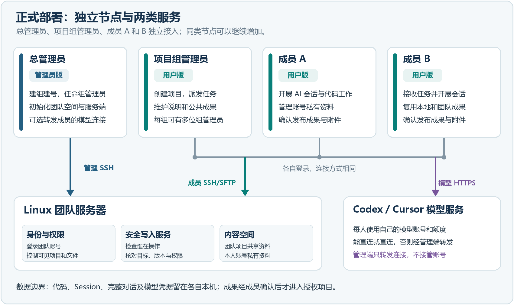

# 团队工作台部署指导

新电脑请先按 [README 的逐步安装命令](../README.md#install)执行：检查 Node/npm → 获取源码 → `npm.cmd ci` 安装依赖 → 下载并检查 Electron → `npm.cmd run start` 或 `start:admin` 启动。每步有成功标志与失败处理；[完整前置条件](../README.md#requirements)也集中在 README。本文补充部署、便捷启动和迁移步骤。产品内的账号、会话、成果与轨迹操作见 [使用指导](user-guide.md)。

## 当前交付状态

- 当前源码版本为 0.7.0，具体提交用 `git rev-parse --short HEAD` 查看，管理员版与用户版分别构建。
- 本轮只更新开发构建，没有重新生成安装包。
- 仓库统一入口：[start-admin-dev.cmd](../start-admin-dev.cmd)、[start-user-dev.cmd](../start-user-dev.cmd)。这两个文件随代码一起交付，不需要部署者重新编写脚本。
- 首次启动检查 Node.js / npm，按 `package-lock.json` 自动安装依赖，然后构建当前源码。之后依赖清单或 Node.js 主版本变化时重新安装依赖；每次启动仍会重新构建。两个入口同时打开时会排队准备环境，准备完成后应用可同时运行。
- `npm ci` 完成后单独检查 Electron 程序、版本和路径记录，缺失时调用已安装版本自带的安装程序，沿用其缓存和校验和。新版 Electron 按首次使用下载运行文件，不能仅凭 npm 安装成功判断可启动。下载失败可直接重新启动，不重复清空 npm 依赖；日志中的 `electron-error.log` 保存具体原因。支持 `--use-system-ca` 的 Node 版本在这一步使用 Windows 信任的证书，以支持已正确安装企业证书的网络代理；不关闭 TLS 校验或修改全局 npm 设置。
- 不会保留后台终端窗口；准备或构建失败会弹窗提示并把日志写入 `.test-data/launcher/`，不会启动旧构建。拉取代码后关闭旧窗口，再双击对应入口即可。已打开的窗口不会自动更新。
- 既有的 0.6.3 安装产物位于打包电脑的 `release/0.6.3/admin` 和 `release/0.6.3/user`；它们不包含当前开发版的全部交互更新。`release/` 未纳入 Git，下载仓库源码不会获得这些安装程序。

## 选择部署模式

| 模式 | 用途 | 权限来源 |
| --- | --- | --- |
| 本地文件系统 | 功能演示、联调和自动化测试 | 应用层权限桩 |
| Linux SSH/SFTP | 团队正式共享 | 独立 Linux 账号、用户组、ACL 和受限文件操作器 |

本地模式不能证明生产权限隔离。拥有 Windows 共享目录系统权限的人仍可绕过应用直接访问文件。

团队共享与模型网络是两条独立通路。SSH/SFTP 始终用于共享空间；只有部分成员无法直接访问 Codex、Cursor 或 Claude Code 时，才需要另行部署可选的[管理端网络出口](network-egress.md)。

## 部署逻辑与角色



图 1 正式 Linux 部署的独立节点、角色职责和交互关系

**先看上方四个节点。** 它们是四个独立的使用身份，不表示必须配置四台物理电脑。总管理员使用管理员版；项目组管理员和普通成员使用用户版。A、B 只是两位成员的示例，实际可有多位组管理员和任意数量的成员。每位用户版使用者都应有自己的成员 SSH 账号和个人模型 CLI 账号。

- **总管理员节点**使用管理员版，以服务器已有 root/sudo 账号准备团队空间、管理账号和组，并更新受限文件操作器。
- **项目组管理员节点**使用用户版，管理本组项目、任务、项目说明和公共内容；**成员 A、B 节点**各自使用用户版，开展个人 AI 会话并确认上传成果。每人使用自己的成员 SSH 账号，同一账号在不同组可有不同角色。
- **团队 Linux 服务器**提供 OpenSSH/internal-sftp、受限文件操作器、账号与组、ACL，以及项目共享区和账号私有空间。用户版通过 SSH/SFTP 读取授权资料和传输文件；写入或修改公共内容时由服务端再次校验身份、目标、版本和权限。
- **模型服务**由各用户版启动的 Codex、Cursor 或 Claude Code CLI 使用个人模型账号访问。模型 HTTPS 可直连，也可经管理员电脑的可选网络出口转发；该出口与服务器共享权限独立。代码目录、Session、完整对话和 CLI 凭据留在各自设备，个人资料按账号私有同步，成果在本人确认后发布到授权项目。

**沿着图验收一次协作。** 总管理员创建组、指定组管理员并开通成员 A、B → 组管理员创建项目和任务 → A 登录后只看到授权内容，在本机用自己的模型账号完成会话 → A 审核并确认上传成果 → B 从项目共享区看到成果。若 B 无法直连所选模型服务，再启用[管理端网络出口](network-egress.md)转发 B 的模型连接；B 的团队 SSH 连接和项目权限不随之改变。

**部署者分别检查两条通路。** 团队通路要验证每个成员 SSH 登录、可见项目、允许的上传和禁止的越权操作。模型通路要从需要的成员端验证个人模型账号登录与一次实际回复；管理端“出口运行中”只能证明转发服务已启动。代码、Session、完整对话和模型凭据留在成员端，项目资料在个人空间同步或经确认后发布到共享区。

## 可选的双击便捷启动

以下是把准备步骤合并执行的便捷方式。需要在终端逐步执行安装、检查每步结果时，使用 [README 第 3～5 步](../README.md#project-dependencies)。手动安装不会写双击入口的依赖准备记录，首次改用双击入口仍会执行一次 `npm ci`。

1. 准备 64 位（x64）Node.js 22.12.0 或更高版本。可安装到系统并保留 npm / PATH 选项；也可将官方便携压缩包完整解压到仓库 `.tools/node-v版本号-win-x64/`，该目录中须同时包含 `node.exe` 和 `npm.cmd`。入口按版本顺序逐一验证 Node 和 npm 的可运行性，每次探测最多 10 秒；失败则尝试下一目录、系统 PATH、自定义目录。所有候选不可用时，窗口允许选择解压后的离线 Node 目录，保存在本仓库 `.tools/node-path.txt`，也可通过 `WORKBENCH_NODE_DIR` 指定。无需修改系统环境变量。
2. 拉取或解压完整仓库，保留 `package-lock.json`、`scripts`、`src` 等文件。无需复制其他电脑的 `dist` 或生成新的启动脚本。
3. 双击根目录的 `start-user-dev.cmd` 或 `start-admin-dev.cmd`。启动窗口会显示当前步骤与等待时间，可查看日志或取消。首次运行需要下载依赖；依赖安装和 Electron 下载各限时 10 分钟，构建限时 3 分钟，超过后提示具体阶段。启动日志位于 `.test-data/launcher/`。失败时检查弹窗给出的日志，修复网络或环境后重新双击即可。
4. 用户版按使用指导连接团队账号并登录个人模型账号。Codex CLI 随 npm 依赖安装；Claude Code 需按官方说明单独安装，使用 `claude auth login` 登录；使用 Cursor 时可在应用内设置已安装的 Cursor Agent CLI 路径，或运行 `powershell -ExecutionPolicy Bypass -File scripts/prepare-runtimes.ps1` 准备仓库配套的 Cursor 运行文件。

依赖下载发生在应用启动前，使用本机 npm / Electron 的下载和代理配置；工作台中的可选管理端模型出口不负责这一步。无法下载依赖的电脑应由部署人员交付对应版本的完整安装包或免安装目录。

### 逐个节点核对运行版本

在每个使用节点的仓库目录运行 `git rev-parse --short HEAD` 和 `git status --short`，同时确认提交和本地修改。关闭旧窗口后使用上述统一入口。启动日志会记录源码目录及实际运行的 `dist/user` 或 `dist/admin`，便于排查启动了另一份目录的情况。打开旧安装包或旧 `dist` 不会自动获得源码里的新功能。

## 本地文件系统部署

1. 准备一个专用空目录作为共享区，例如 `D:\TeamAgentDemo\shared`。业务代码目录与共享区分开。
2. 启动管理员版，在连接设置中选择“本地文件系统（模拟权限）”，选择共享目录并初始化。
3. 创建用户组、成员及组管理员，为各用户启动器预置本地共享区和账号。
4. 用户版只选择自己的本机工作路径；共享区根目录由联调启动器预置，不让用户选择。
5. 多人同机联调时，每个用户进程必须使用不同的 `WORKBENCH_DATA_DIR`；管理员使用 `WORKBENCH_ADMIN_DATA_DIR`。正式使用建议每人使用自己的 Windows 账号。

现有联调环境：`D:\agent开发\比赛协同联调\run-20260916-02`。

- `打开管理员.cmd`
- `打开用户A.cmd`
- `打开用户B.cmd`
- `打开用户test1.cmd`

这些联调启动器预置演示账号的数据目录，使用 `D:\agent开发\team-agent-workbench\dist/user` 或 `dist/admin`，保留原共享区登记和历史数据；它们不用于其他电脑的正式部署。使用旧联调脚本前应先在仓库执行 `npm run build`。

## Linux SSH/SFTP 部署

服务器要求：Linux、Python 3.9+、OpenSSH、shadow/passwd 用户管理命令、procps、ACL 支持（setfacl 或 libacl），以及运行中的 systemd 或下文支持的 Supervisor 容器环境。管理员应使用服务器已经存在的 root 或 sudo 账号；Windows 管理员身份不能替代 Linux 管理权限。

1. 规划团队根目录，例如 `/srv/teamspace`，并确认目标路径不存在或为空。
2. 在管理员版填写服务器地址、端口、root/sudo 账号和团队根目录。首次连接时确认服务器地址，本机会记住服务器身份，之后自动校验。
3. 连接后先检查远端 Linux 服务器的环境提示。缺少 `setfacl` 时自动尝试系统 `libacl.so.1`，保持相同 ACL 权限。两者都不可用时提供安装指引及“查看服务器修复方式”入口；只有管理员在弹窗点击“在服务器执行修复”，程序才通过当前 SSH 连接在远端执行安装。本机 Windows 不安装或下载这些组件。也可自行在服务器安装后点击“重新检查服务器”，无需重新登录。环境通过后执行“初始化团队空间”，创建受保护的账号登记、成员组和元数据目录；首次创建成员时再配置 `internal-sftp` 和受限文件服务。
4. 创建工作组并准备目录。服务器需要 `setfacl` 或 `libacl`；项目共享读写最终由 Linux 所有权、组和 ACL 执行。
5. 创建独立成员账号。每个成员使用自己的 SSH 账号和密码，一个账号可加入多个项目组。
6. 向成员交付服务器地址、SSH 端口、成员账号和初始密码。成员不需要管理员配置文件或服务器指纹。

成员 SFTP 接入没有独立配置入口。管理员创建用户时会在同一次可恢复操作中启用 sshd drop-in，并校验、补齐 SSH 登录规则与受限文件操作器；SSH 校验或重载失败会恢复原主配置和团队规则。配置失败时用户不会被标记为创建完成，应在管理员版修正错误后继续该创建操作。

### 在线与离线准备环境

在“服务器环境待完善”中点击“查看服务器修复方式”，选择方式后点击“在服务器执行修复”：

- **在线**：管理端通过 SSH 让远端服务器使用自身已配置的软件源和网络下载、安装目前缺少的 `acl`、`supervisor` 及其依赖；Windows 本机不下载。软件源可以在内网。自动安装目前支持 Debian/Ubuntu 的 apt-get；保留已有配置，不自动移除软件包。
- **离线**：管理员先自行将匹配发行版、架构的 `.deb` 包和完整依赖放到服务器专用目录（例如 `/opt/workbench-packages`），再在窗口填写该服务器上的 Linux 路径；管理端不会从 Windows 本机上传安装包。目录、包及上级目录必须 root 拥有且其他账号不可写。界面会在远端安装目录内的包，只应放本次组件和依赖；apt 使用 `--no-download`，缺包会失败，不会回退外网下载。离线文件内容应来自已核验的软件源，本工具的目录权限检查不替代来源验证。
- 该入口支持团队初始化之前使用，不创建项目组或成员。失败后显示错误，可补齐依赖再重试；已满足条件时不重复安装。
- 环境准备不会因 SSH 或账号管理命令缺失就安装整套 SSH 服务。此类缺失仍显示具体要求。

已有 systemd 或可管理的 Supervisor 会复用。无 systemd 且没有可用 Supervisor 实例时，准备流程会尝试补齐软件包，并创建专用配置 `/etc/team-agent-workbench/supervisord.conf`、`conf.d` 和启动脚本 `start-supervisor.sh`，启动本工具的 Supervisor 实例，不重启托管 SSH 的实例。再次执行会先检查已运行实例；已有专用配置被修改时不会覆盖。

专用实例当前启动成功，不代表容器启动流程已接入。管理员须在现有启动流程中调用 `/etc/team-agent-workbench/start-supervisor.sh`，并持久化 `/etc/team-agent-workbench` 和团队目录；它不会替换容器原有的前台主进程。页面会持续显示此要求。重启后的自动恢复必须在目标环境验收。

ACL 回退仅用于缺少命令，不会在权限拒绝、文件系统不支持 ACL 时更换实现以跳过错误。现有公共文件、用户请求目录和回执使用同一 ACL 实现；不能通过忽略 ACL 失败继续发布。

### 无 systemd 的容器

程序检查 PID 1 是否为 systemd。对于 PID 1 为 bash 等情况，目前支持由 **Supervisor** 托管文件服务，需要：

- Supervisor 已运行，`supervisorctl` 可用；主配置为 `/etc/supervisor/supervisord.conf` 或 `/etc/supervisord.conf`。
- `[supervisorctl] serverurl` 使用本机 `unix://` socket；配置、socket 和父目录由 root 管理且不允许其他账号写入。支持 root 控制的 `/var/run` → `/run` 等系统链接。
- 主配置的 `[include] files` 加载现有目录中的 `*.conf` 或 `*.ini`，例如 `conf.d/*.conf`。工具只增加本团队的 `team-agent-storage-团队ID` 配置，并只更新、重启这个服务。
- SSH 提供 `service` 和 `/etc/init.d/ssh` 或 `/etc/init.d/sshd`。工具先运行 `sshd -t`，通过后才执行 `service ssh reload` 或对应的 sshd 重载，不自动重启 SSH。
- 容器的 entrypoint 或启动流程必须启动同一 Supervisor，并保留团队目录及 Supervisor 配置。生成的服务设置 `autostart=true`、`autorestart=true`，会随 Supervisor 启动，并在异常退出时重启；单独用 `nohup` 或 `start-stop-daemon` 启动一个进程不视为持久托管。

未找到上述托管方式时会明确显示环境问题并阻止创建，不会误报已就绪。文件服务必须进入 `RUNNING`（systemd 为 active）后才确认接入完成。之前失败的 `user_create` 可在修复环境后，从“待恢复操作”点击“继续完成”，仍须重新输入初始密码；不应手工再次创建同名 Linux 账号。

ACL 工具存在不代表所有挂载点支持 ACL。部署者还应在实际团队目录所在文件系统验证 ACL 可设置；文件系统不支持时应调整挂载/存储配置。容器重启、真实 SSH 新连接和共享文件读写仍须在目标容器验收。

当前成员端采用 TOFU：首次连接由用户确认地址并保存当时的服务器身份，后续变化会被拦截。它消除了管理员分发指纹的步骤，但无法单独识别首次连接时已经存在的中间人攻击。对首次身份也有强验证要求时，应在基础设施中部署 SSH 主机证书，由客户端内置或统一下发企业 SSH CA 公钥。

账号登记位于 `<团队根路径>/.workbench/admin/state.json`，操作记录位于同目录 `audit.jsonl`，受保护的组管理员任命位于 `<团队根路径>/.workbench/roles.json`。

部署后必须在目标 Linux 发行版验证：账号创建与停用、密码重置、组变更、SFTP chroot、ACL 拒绝、旧连接失效、成员跨组隔离和组管理员权限。回环协议测试不能替代这项验收。

### 从旧源码升级到 5fe696d

1. 先确认各节点的仓库提交和未提交修改，保留本机 Session、成果和应用数据；关闭旧用户版与管理员版窗口，再拉取同一提交并通过统一入口重新构建。
2. 总管理员在新版管理员版连接既有团队空间，从用户管理页点击**更新服务端功能**，安装新版受限文件操作器。**不要重新初始化既有空间。**新版个人分类记录、任务附件、验收/删除状态及账号同步需要新版服务端；旧服务端会明确拒绝不支持的请求，不能靠只更新用户版启用。
3. 用户重新登录后，先核对**本地项目成果库**、**团队项目成果库**和**成果整理**三个入口，再检查个人分类组合、任务视角、附件下载、提交验收及组管理员审核。旧成果和原 Session 不会因升级自动重分类或迁移。
4. 从有权限的测试账号验证成员 SSH 登录、账号资料同步、任务派发与验收、团队成果访问和越权拒绝；模型登录与管理端网络出口单独核对。真实 Linux ACL 与服务端重启后的恢复仍须在目标环境验收。

本轮提供源码与后台测试，没有重新生成 0.7.0 安装包，也没有在真实团队服务器执行升级。部署者应使用新版管理端更新现有服务端，并在维护窗口完成实际验收。分类与任务边界见[个人成果分类与任务入口](result-classification.md)。

## 开发构建

```powershell
npm ci
powershell -ExecutionPolicy Bypass -File scripts/prepare-runtimes.ps1
npm run check
npm test
```

`npm run check` 包含类型检查和隔离临时目录中的构建，不覆盖正在运行的 `dist/user` 或 `dist/admin`；`npm test` 只运行后台回归，不启动 Electron 或浏览器。可见界面、启动器、真实 CLI 和需要操作真实服务器的测试应在独立测试机器或明确安排的空闲时段执行，不作为日常后台验证命令。具体范围见[后台验证方式](background-testing.md)。

开发启动：

```powershell
.\start-admin-dev.cmd
.\start-user-dev.cmd
```

`scripts/build.mjs` 分别生成 `dist/admin` 和 `dist/user`。需要新安装包时运行 `npm run package`；管理员版与用户版使用不同的应用 ID、安装目录和本机数据目录。打包前应完成真实目标机验收并配置企业代码签名。

## 迁移到其他电脑

1. 安装对应的管理员版或用户版，或完整复制免安装目录；不要只复制单个 exe。
2. 用户填写服务器地址、SSH 端口和自己的 SSH 账号密码，并选择新电脑上的本机工作路径。
3. 在新电脑上分别登录个人 Codex、Cursor 或 Claude Code 账号。模型凭据由厂商 CLI 管理，不随工作台配置迁移。
4. 本地会话位于各自的应用数据目录，不会自动上传到团队共享区。需要迁移本地历史时，应在应用关闭后整体迁移对应数据目录。
5. 新电脑首次连接时确认一次服务器地址。身份变化时客户端停止登录；确认服务器确实重装或迁移后，用户在错误提示旁点击“重新确认”。正常登录页不显示指纹或技术信息。

## 部署验收

- 管理员版和用户版可同时启动，数据目录互不覆盖。
- 普通成员不能看到未加入的工作组，也不能写入他人的个人成果目录。
- 一个账号加入多个组后可一次登录发现全部授权组。
- 移出组、停用账号或修改密码后，旧共享访问不再有效。
- 用户只能选择本机工作路径，共享路径由账号权限与配置确定。
- 文字成果按所选类别进入项目的 `submissions/账号/` 下对应分类目录；旧成果类别与新类别均须能读取，不能只按早期五类检查。轨迹上传进入 `trajectories/账号/`。分类子目录由受控文件操作器在首次上传时创建；任务附件和成果附件按各自权限另行核验。
- 网络中断和应用重启不会把待上传内容改投其他项目或身份。
- 未启用管理端出口时，CLI 保持原有直连环境；启用后，仅工作台启动的 Codex、Cursor 或 Claude Code CLI 收到本机代理变量。
- 管理端出口只允许配置中的 Codex、Cursor 或 Claude Code HTTPS 域名和 443 端口，并由用户端校验接入码中的 TLS 证书指纹。

本地模式的详细目录与权限桩行为见 [本地文件系统联调](local-filesystem.md)，正式身份边界见 [身份与协作说明](identity-content.md)。
