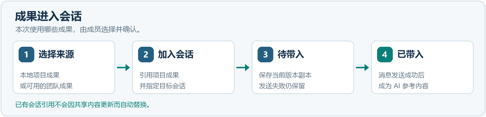
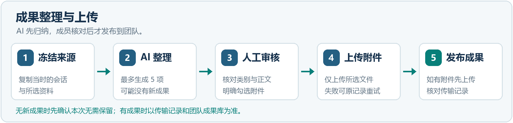
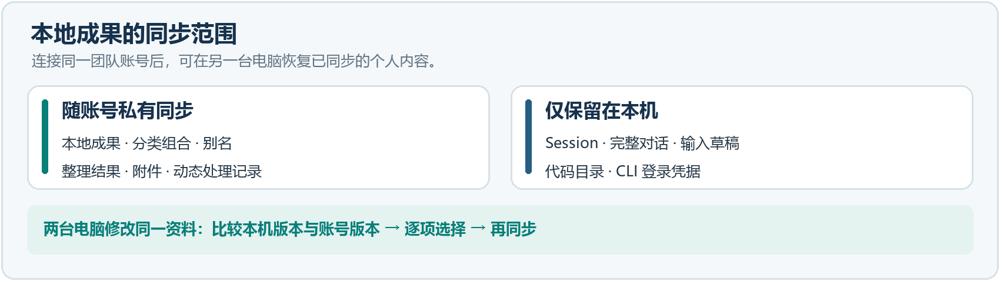
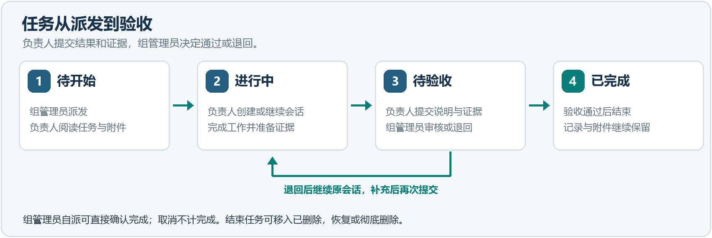
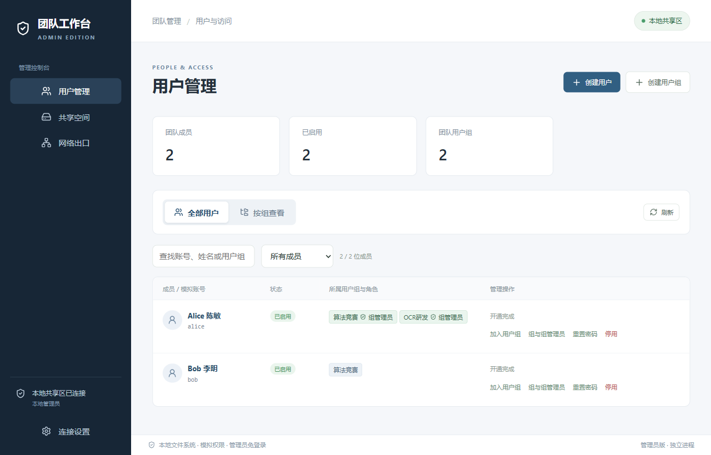
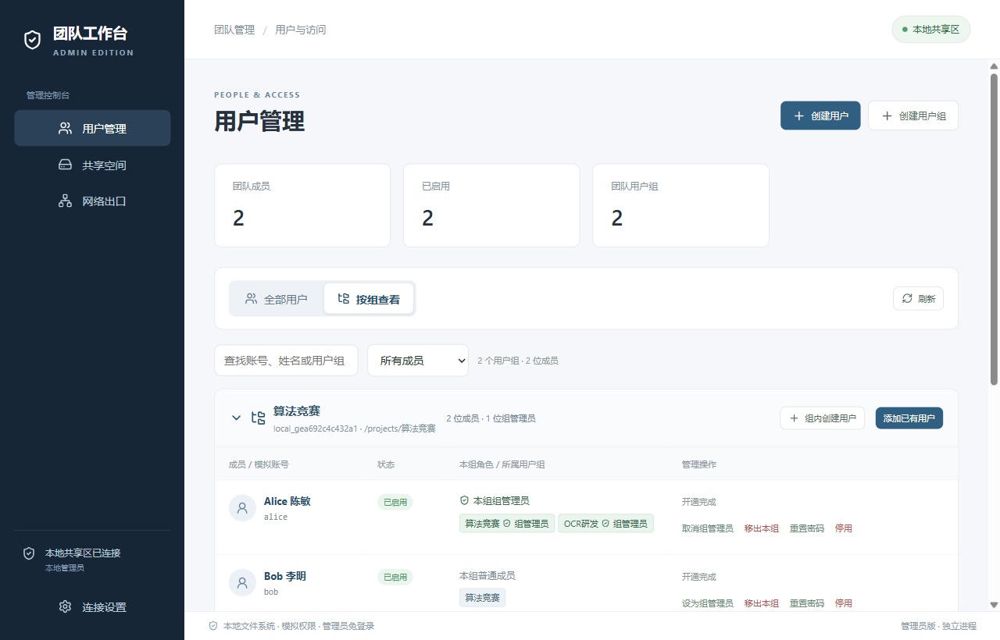
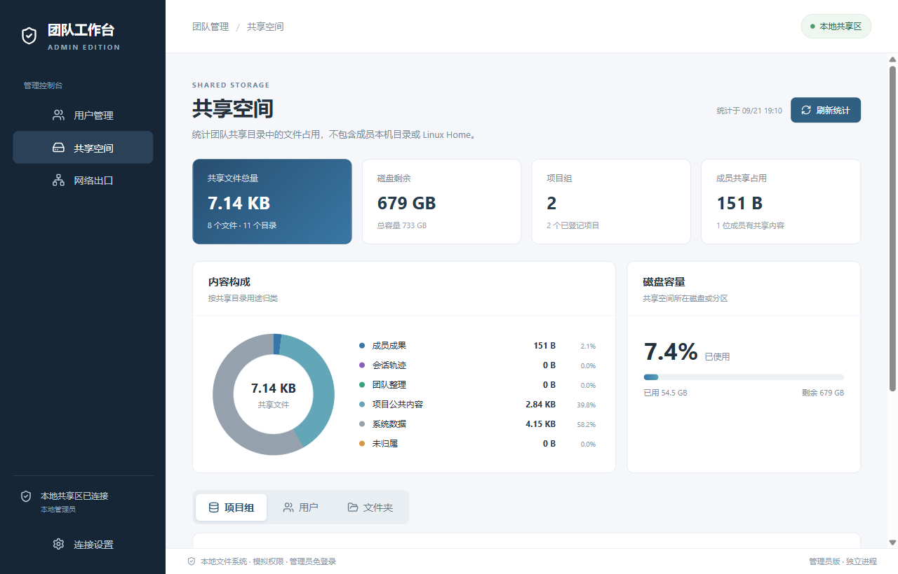

# 团队工作台使用手册

本 Markdown 已同步当前源码的项目目录、统一成果库与类别筛选交互。v1.3 的网页、Word、PDF 和截图仍是此前版本；涉及差异时以本页步骤和 [README 安装说明](../README.md#install)为准。

用户版与管理员版

文档版本 1.3

适用软件版本 0.7.0

功能核对版本 5fe696d

发布日期 2026 年 9 月 23 日

本手册面向普通成员、项目组管理员和总管理员。先用下方任务导航找到要做的事，再按“入口、步骤、完成标志”操作。界面按钮以粗体标出；示例中的人名、项目和数据只用于说明流程。

本手册以已完成环境准备的 Windows 工作台为前提。软件安装、服务器部署、离线依赖准备及源码构建，请参阅独立的[部署指导](deployment-guide.md)。旧安装包不一定包含本手册中的全部功能。

本版说明本地与团队项目成果库、成果分类、任务验收与附件、Codex 运行中引导，以及团队成果批量删除。个人会话、完整对话、代码目录和模型登录信息留在本机。正式 Linux 环境使用新功能时，用户端和服务端都要更新；管理员界面截图来自本地演示环境。

Claude Code 是此版手册完成后新增的 CLI 选项。安装、登录、权限、Skill 和网络出口操作见 [Claude Code 接入说明](claude-code.md)；下文没有列出的 Claude Code 操作以该说明为准。

<!-- pagebreak -->

## 按任务查找

按当前要做的事进入。普通成员主要看第 2～10 章；项目组管理员再看第 11 章；总管理员看第 12～14 章。

| 您现在要做什么 | 直接进入 |
| --- | --- |
| 第一次进入成员工作台 | [登录](#section-2-1) → [创建会话](#section-4-1) → [整理成果](#section-6-1) |
| 让 AI 使用项目说明或团队成果 | [选择成果](#section-5-1) · [更新项目说明](#section-5-3) |
| 调整模型、权限或能力 | [模型和权限](#section-4-3) · [Skill 和插件](#section-4-4) |
| 在 Codex 回复过程中补充要求 | [引导正在运行的任务](#section-4-5) |
| 分享工作成果和附件 | [发起整理](#section-6-1) → [人工核对并上传](#section-6-3) → [检查传输](#section-10-3) |
| 查看并采用队友成果 | [团队动态](#activity) · [本地项目成果库](#conclusions) |
| 选择类别、同步个人成果 | [成果类别](#section-8-4) · [同步与冲突](#section-8-3) |
| 接收任务、提交验收 | [开始任务](#section-9-1) · [任务状态](#section-9-2) |
| 上传文件或会话轨迹 | [共享文件](#section-10-1) · [上传轨迹](#section-10-2) |
| 创建项目、派发并验收任务 | [创建项目](#section-11-1) → [派发任务](#section-11-2) → [验收](#section-9-2) |
| 管理团队成果 | [编辑与批量删除](#section-11-3) · [语义合并](#section-11-4) |
| 管理账号、组和共享空间 | [创建账号](#section-12-2) · [调整角色](#section-12-3) · [查看占用](#storage) |
| 部署、网络出口或故障处理 | [部署组成](#section-1-4) · [网络出口](#gateway) · [常见问题](#help) |

**常用入口。** 普通成员和项目组管理员使用用户版；总管理员使用管理员版。源码运行的固定入口分别为仓库根目录中的 `start-user-dev.cmd` 和 `start-admin-dev.cmd`。更新后关闭旧窗口，再通过原入口启动。

**阅读约定。** 界面名称以粗体标出。“当前项目”指左侧选中的项目；已有会话仍绑定创建时的项目，切换左侧项目不会改变它。

**完成一次协作：**登录用户版 → 选择项目 → 新建会话并工作 → 整理成果与附件 → 检查并确认上传 → 队友从团队动态查看 → 选择存入本地项目成果库或加入指定会话。

## 1 了解角色和数据归属

### 1.1 选择正确的应用

| 身份 | 使用入口 | 主要职责 |
| --- | --- | --- |
| 普通成员 | 用户版 | 开展会话、接收任务、上传个人成果、使用团队资料 |
| 项目组管理员 | 用户版 | 普通成员能力，以及创建项目、维护项目说明、派发任务、管理团队成果 |
| 总管理员 | 管理员版 | 创建账号与用户组、配置组内角色、启停账号、查看共享占用、配置可选网络出口 |

项目组管理员下文简称“组管理员”。同一个账号可以加入多个组，并在不同组中担任不同角色。总管理员使用独立的管理员版。

### 1.2 区分两类账号

**团队账号**是管理员分配的服务器 SSH 账号。工作台按服务器上的成员关系展示工作组和项目；一个账号不必逐组登录。

**模型账号**是成员自己的 Codex 或 Cursor 账号，用于 AI 对话和额度计费。登录团队服务器不会自动登录模型；使用管理端网络出口也不会借用管理员的模型账号。

### 1.3 哪些信息会被共享

| 信息 | 保存位置 | 何时被团队看见 |
| --- | --- | --- |
| 代码目录、会话、完整对话、阶段摘要、输入草稿、模型登录信息 | 本机 | 不因日常对话或账号资料同步而共享 |
| 本地项目成果、分类组合、别名、整理结果、已选附件和动态处理记录 | 本机与账号私有空间同步 | 仅本人账号可恢复；需另行发布成果才由团队看见 |
| 项目说明、团队项目成果、项目任务及其附件 | 团队共享空间 | 授权成员按角色查看或操作；任务附件仅负责人及本组管理员可读 |
| 成果附件 | 选取后先保存个人副本 | 确认上传且附件传输成功后随成果供项目组访问 |
| 会话轨迹 | 上传前在本机，上传后在项目目录 | 手动上传，或按用户启用的自动上传设置执行 |
| 仓库链接和版本信息 | 可选地随成果保存 | 确认上传对应成果后 |

普通成员只能修订自己上传且尚未由组管理员接管整理的团队成果。组管理员可维护本组团队成果。已整理内容需要修改时，交由组管理员处理，或另行提交补充结论。

### 1.4 部署逻辑与角色职责

图 1 正式 Linux 部署的独立节点、角色职责和交互关系

先按箭头读图：**蓝色**表示总管理员管理团队服务器，**青绿色**表示组管理员和成员访问团队项目，**紫色**表示用户版连接模型服务。图中线条汇合只为简化画法，每个使用者仍分别登录自己的账号。

**图中的节点是谁。** 四个上方方框表示四个独立使用节点，并不限定要准备四台物理电脑。成员 A、B 只是示例；一个组可以有多位组管理员，也可以继续增加成员。每个人用自己的团队账号和模型账号登录。

- **总管理员**打开管理员版，使用服务器已有的 root 或 sudo 管理账号（服务器管理权限）初始化团队空间、建立组和成员账号、指定组管理员，并更新服务端功能。
- **项目组管理员**打开用户版，使用自己的成员账号创建本组项目、派发任务、维护项目说明和团队成果，也可以开展自己的 AI 会话。
- **成员 A、B**各自打开用户版，查看有权访问的项目和任务，开展 AI 会话、使用项目资料，并决定是否把成果与附件分享给项目组。两人的操作和私有资料不会因为在同一组就自动合并。
- **Linux 团队服务器**保存成员和组关系、项目共享资料及各账号的私有资料。用户版用 SSH 登录、用 SFTP 传输文件；服务器在读取和修改时检查账号、组和访问规则。“安全写入服务”还会核对修改目标、版本和权限。
- **Codex / Cursor 模型服务**接收用户版启动的 CLI 发出的模型请求。每个人使用自己的模型账号和额度；团队服务器的 SSH 登录不会替代模型登录。

**沿着一次协作看连接。**

1. 总管理员建组并创建组管理员、成员 A、成员 B 的账号。三人之后分别用自己的账号登录用户版。
2. 组管理员创建项目和任务，内容写入团队服务器。成员 A、B 登录后，只能看到自己获授权的组、项目和资料。
3. 成员 A 在本机开会话并调用 Codex 或 Cursor。代码目录、Session、完整对话和模型登录凭据留在 A 的本机；A 可主动选择资料加入会话。
4. A 核对成果并确认上传后，服务器校验身份和权限，再把成果及选中的附件放入项目共享区。B 才能从团队动态或团队成果库中看到并复用它们。
5. 如果 B 能直连模型服务，就直接连接；如果 B 只能访问内网，可按[管理端网络出口](#gateway)的步骤接入管理员提供的转发通路。B 仍使用自己的模型账号，团队资料仍走服务器的 SSH/SFTP 连接。

图中的灰线只表示组管理员和成员采用相同的接入方式，不表示共用账号。本地项目成果等内容可以在本人账号的私有空间同步；发布到项目共享区需要成员确认。安装步骤、服务器要求与本地演示模式见[部署指导](deployment-guide.md)。

**接下来可以做：**[登录工作台](#section-2-1) · [创建项目](#section-11-1) · [创建账号](#section-12-2) · [返回任务导航](#start)

## 2 登录并进入项目

### 2.1 首次登录

操作入口：打开用户版，进入**登录团队工作台**。

1. 填写管理员提供的服务器地址、SSH 端口、成员账号和密码。
2. 登录时无需填写代码目录；远端共享目录由账号权限决定，不由成员填写。
3. 本机可直接访问模型服务时，不启用**通过管理端访问模型服务**。确需借用管理端出口时，按[用户端接入步骤](#section-14-2)填写接入码。
4. 点击登录。首次连接该地址和端口时，核对服务器地址并完成首次确认。
5. 在**我的工作组**中展开所属组，选择项目。第一次进入每个项目时，可选填**代码目录**或选择**暂不设置**；两种选择都会记住，后续不再提示。

**完成标志：**右上角显示已连接账号；左侧显示授权组和项目。尚无项目时，普通成员需等待组管理员创建。

### 2.2 再次登录和修改连接

地址、端口和账号会记住；密码不保存，每次启动仍需输入。修改连接时，点击右上角服务器按钮。代码目录按账号、项目保存在本机，在**设置 → 项目设置**中修改或清空；普通成员也可修改自己的目录，已有会话继续使用原路径。

服务器身份变化时，工作台停止登录并提供**重新确认**。先向维护人员确认是否发生重装或更换，再继续；重新输入成员密码不能解决服务器身份变化。

### 2.3 工作组变化和多个账号

管理员调整组或角色后，点击左侧**刷新工作组与项目**。尚未分组时，联系管理员分配后再次刷新；未分组账号没有项目工作台。

打开另一账号时，点击**新建账号窗口**。各窗口分别保存连接、会话、草稿和传输记录。再次运行启动入口会优先打开尚未打开的已有账号窗口；全部已打开时唤回现有窗口。

### 2.4 断网工作

已核验项目可继续使用本地会话、草稿和已有成果，顶部显示**离线工作中**。本地项目成果的离线修改保存在本机，恢复连接后再同步；共享读写需服务器连接。模型能否使用，另取决于其网络通路。

当前版本不对已有本地工作设置离线时长上限。重新连接时重新核验共享权限。

**接下来可以做：**[创建第一条会话](#section-4-1) · [没有工作组或登录失败](#section-16-1) · [返回任务导航](#start)

## 3 认识用户版工作台

| 位置或入口 | 用途 |
| --- | --- |
| 最左侧功能栏 | 切换任务、动态、会话、项目成果库、成果整理、传输记录等页面；成果库内通过“团队 / 个人”切换，鼠标停留可查看入口名称 |
| 我的工作组 | 按组选择项目，查看项目资料和共享文件 |
| 本地会话 | 打开会话；每个会话保留独立记录和输入草稿 |
| 会话顶部 | 查看所属项目、重命名、查看 AI 参考内容及文件、整理成果、上传轨迹、关闭会话 |
| 对话输入框 | 输入任务、引用项目成果，选择模型、执行权限、Skill 和插件；Codex 运行中可引导 |
| 右上角账号区域 | 检查连接，修改连接或新建账号窗口 |

项目区与会话区之间的分隔条可以拖动；方向键可微调，双击恢复默认比例。不同账号窗口分别保存布局。

**操作前先确认项目。** 团队成果、本地成果和任务围绕当前项目展示。会话标题下方显示会话实际绑定的项目，判断会话归属时以这里为准。

**接下来可以做：**[开始会话](#section-4-1) · [查看队友更新](#activity) · [返回任务导航](#start)

## 4 创建和管理 AI 会话

### 4.1 创建会话并开始工作

1. 选择项目，点击新建会话入口。
2. 选择 **Codex**、**Cursor** 或 **Claude Code**、模型和执行权限。会话自动绑定当前项目，使用项目已记住的代码目录，不需要重复填路径。项目未设置代码目录时，新会话使用独立、持久的调研目录。
3. 查看模型账号状态。未登录时，通过界面入口完成对应 CLI 的登录并重新检测；已登录时核对显示的账号。
4. 创建会话，输入目标、已有资料、期望产出和验收要求。
5. 按 **Enter** 发送；按 **Shift+Enter** 换行。
6. 检查回复和实际产物。出现待批准操作时，根据本次操作决定是否允许。

**任务示例：**“请比较两种转换路径。先验证正确性，再记录设备、输入规模和耗时波动；输出比较表与未验证项。”

模型信息按 CLI 可提供的方式展示；Claude Code 的套餐额度需打开官方额度页查看。读取失败表示暂时无法取得信息，不代表额度为零。网络检测失败也不等于账号未登录。

### 4.2 会话生命周期

| 操作或状态 | 对记录的影响 | 下一步 |
| --- | --- | --- |
| 停止任务 | 保留已生成记录、输入草稿和上下文 | 检查结果后主动继续，不会自动重发 |
| 关闭会话 | 保留对话、阶段摘要及会话身份 | 需要工作时重新打开；关闭时不能发送新任务 |
| 重启后任务中断 | 保留已有结果，显示中断或错误 | 检查文件实际变化，再决定重试或继续 |
| 重命名会话 | 更新本机名称及后续上传的来源名称 | 历史上传名称不会被改写 |

同项目可创建多个会话。记录相互独立，但**如果选择同一个代码目录，文件修改仍会相互影响**。并行修改代码应使用不同目录或已准备好的 Git worktree；创建会话本身不等于创建独立代码副本。Session、完整对话和代码目录不会随个人资料同步到另一台电脑。

### 4.3 修改模型和执行权限

入口位于输入框底部。运行中的任务需先停止，再修改。修改权限会重启底层会话进程并保留上下文；下一条消息由用户主动发送，不自动重放上一任务。

| 提供方 | 选项 | 对使用的影响 |
| --- | --- | --- |
| Codex | 请求批准 | 在工作目录内执行，超出范围时可能要求确认 |
| Codex | 帮我批准 | 自动审查符合条件的批准请求，仍可能要求人工确认 |
| Codex | 完全访问 | 可访问本机账号允许的文件和网络，通常不再请求批准 |
| Cursor | Allowlist 白名单 | 已允许的操作直接执行，其余操作可能要求确认 |
| Cursor | Run Everything 全部运行 | 自动执行工具操作，明确禁止项仍可能被拒绝 |
| Cursor | Auto-review 自动审查 | 当前接入方式不支持可靠切换，选项不可选 |
| Claude Code | 手动批准 | 未预先允许的操作会请求确认 |
| Claude Code | 自动审查 | CLI 自动审查操作，必要时仍请求确认；能否使用取决于账号和组织设置 |
| Claude Code | 跳过权限询问 | 跳过常规询问，仍受明确拒绝规则和组织策略约束 |

**以实际显示为准。** CLI 或组织策略可能收窄权限。若显示自定义设置或限制，阅读影响说明后再调整。批准模式不能超越 Windows 账号本身的权限。

批准请求只对应当前操作。选择自动审查或完全访问后仍出现请求时，也应按界面处理；工作台不会替用户点击允许。

### 4.4 选择 Skill 和插件

1. 打开输入框的能力菜单，查看当前提供方可用的 Skill 或插件。
2. 选择需要的能力，确认输入框上方出现标签。
3. 填写任务并发送。选择只作用于下一条消息，成功发送后自动清空。

未发送的选择随草稿保留。找不到能力时，先在对应 Codex、Cursor 或 Claude Code 中安装、登录或启用，再回到菜单刷新。

Codex 使用其原生 Skill 和插件调用方式；Cursor 每条消息显式选择一个 Skill，已配置的 MCP 工具显示在插件区域；Claude Code 的 Skill 使用 `/名称` 调用，已安装插件由 CLI 加载。选择器不负责安装插件，也不授予额外权限。

### 4.5 引导正在运行的 Codex 任务

Codex 正在生成回复或等待授权时，可以在**原输入框**补充要求，不必先停止当前任务。写好文字后点击**引导**或按 **Enter**；确认框会显示目标会话、待发送内容及本次选择的成果、文件、Skill 和插件。核对后点击**确认发送引导**，这段内容才进入当前执行轮次。按 **Shift+Enter** 仍可换行，取消确认会保留输入。

**例如：**Codex 正在比较两条技术路径时，可补充“先核对数据划分是否一致，把无法验证的性能结论明确标出”。新选择的参考资料也可随本次引导带入；已经送达的引用不会重复发送。

只有 CLI 确认接收后，界面才记录“引导”并清除本次输入。发送失败、任务已结束或轮次已变化时，输入保留，重新确认后再处理；工作台不会把它转成下一轮普通提问。引导不绕过待批准操作，也不修改模型与执行权限。**停止**仍是单独操作。

Cursor 当前接入方式不支持这种不中断当前任务的引导，界面会显示限制；需要补充要求时等待当前任务完成，或按实际需要停止后重新发送。

**接下来可以做：**[给 AI 添加资料](#section-5-1) · [整理工作结果](#section-6-1) · [权限问题](#section-16-1) · [返回任务导航](#start)

## 5 将项目成果带入会话

图 2 项目成果从选择到被 AI 接收的流程示意

### 5.1 选择本次需要的成果

左侧**本地项目成果库**保存个人整理、手工记录和从团队共享区采用的内容。在会话输入区点击**引用项目成果**，按标题或内容查找，勾选后点击**加入当前会话**。也可从本地或**团队项目成果库**的详情选择**加入会话**，指定同项目的工作会话。

加入时保存该版本的本地副本，供下一次提问使用，不改变正在执行的任务。已加入的资料显示**已加入**且不能在选择窗口取消；关闭的会话不能新增引用。

首次提问时，工作台可能根据问题推荐相关项目成果。只勾选本次需要的内容，也可不带入直接发送。推荐只用于检索，不会自动合并成果或代替人的选择。

### 5.2 理解待带入和已带入

| 界面信息 | 含义 |
| --- | --- |
| 输入框上方的待带入成果 | 已选择，但尚未被 AI 对话接收 |
| AI 参考内容中的已带入 | 当前 AI 对话已经接收该成果 |
| 阶段摘要 | AI 在本机维护的目标、发现、证据和待办 |
| 项目资料新版本提示 | 共享说明已更新，可决定是否更新会话使用的版本 |

发送失败时，待带入成果保留。已接收的相同成果不会在同一底层对话中反复发送；每条消息无需手动粘贴成果路径或校验信息。

### 5.3 团队资料更新后如何处理

团队成果被修改、合并或移除，不会直接改写已有会话的引用副本。根据动态查看变化，再决定是否采用新版本。从旧动态加入已更新的成果时，先核对弹窗中的当前标题与版本；确认后才加入当前版本。

项目资料更新后，打开会话顶部的**AI 参考内容**，核对版本并按需点击**更新项目说明**。运行中的任务需先停止。继续旧实验时可保留原依据；新一轮工作应核对新的目标和验收要求。

**阶段摘要与成果说明不同。** 前者帮助 AI 延续工作，不会自动上传；后者面向团队表达可复用结果，需在整理页面检查并确认上传。

**接下来可以做：**[查找队友成果](#activity) · [管理本地成果](#conclusions) · [返回任务导航](#start)

## 6 整理并上传工作成果

图 3 成果整理与上传顺序示意

### 6.1 发起整理

适用情况：得到一项结论、验证记录、问题分析或方向建议，准备供团队参考。没有代码改动或仓库链接也可以上传。

1. 在来源会话顶部点击**整理成果**。
2. 工作台复制此刻的对话、阶段摘要和所选资料，后台 AI 只依据这份副本整理。
3. 可返回原会话继续工作。之后新增的消息不会混入本次整理。
4. 从左侧**成果整理**查看整理记录与进度；完成后打开详情。
5. 检查标题、正文、自动归类和附件，决定保留哪些项。

| 状态 | 可执行的操作 |
| --- | --- |
| 正在整理 | 返回会话继续工作，或停止整理 |
| 整理失败 | 恢复网络或模型环境后重试 |
| 已整理好，请确认后上传 | 检查结果、补充说明，再确认上传 |
| 本次没有新成果 | 查看原因及可能已存在的成果；确认本次无需保留，或调整类别后重新整理 |

顶部的返回入口可回到来源会话。返回不会上传，也不会停止后台整理。

整理使用独立助手，默认以完全访问权限运行，不改变原工作会话的权限。模型先合并同一主题，再按你为当前项目选择的分类组合判断主类别；一次最多生成 **5 项**，也可能没有值得保留的新内容。它不会为每个类别凑一项。本机安装、依赖、登录、代理或资源不足等环境故障不整理为项目成果；影响结论的验证限制应保留。整理完成后仍需用户核对并确认上传。

### 6.2 核对类别与内容

| 类别 | 何时使用 |
| --- | --- |
| 项目结论 | 有足够证据支持、可复用的项目判断 |
| 项目标准 | 人已明确确认的要求、验收口径或规则 |
| 需求说明 | 需要做什么、哪些内容不在范围内 |
| 设计方案 | 针对具体需求已选定的实现方案 |
| 方法探索 | 值得验证、尚未证明有效的方法 |
| 验证结果 | 一次验证实际证明的范围与限制 |
| 问题与风险 | 尚待解决的项目问题或风险 |
| 排障经验 | 已验证的项目缺陷原因和修复方法 |
| 操作指南 | 可以重复执行的项目业务或交付操作 |
| 调研发现 | 有来源的外部资料中的重要事实 |
| 方案对比 | 多个选择在相同维度上的差异 |
| 改进建议 | 尚未采纳的改进对象、理由和建议 |

每个账号可在**设置 → 整理分类组合**为当前项目选择一个分类组合，也可从整理窗口点击**调整分类组合**。例如，做软件开发时可以选包含“需求说明、设计方案、验证结果、问题与风险”的组合；本次整理还可临时取消不需要的类别。更改组合只影响后续整理，不会给旧成果重新分类。

**类别由人最终确认。** 一次实测观察写“验证结果”；有足够证据支持可复用判断时才写“项目结论”；未经负责人确认的建议不能写成“项目标准”。同一主题的方法、结果和限制应放在一项，来源和技术参数可在默认收起的**来源详情**核对。上传前可以更正类别，上传后不能从整理页改写共享类别。完整边界见[个人成果分类与任务入口](result-classification.md)。

### 6.3 审核并确认上传

1. 逐项核对标题、类别和正文，特别检查证据范围、限制条件与结论是否一致。需要说明背景时，在**给团队的补充（可选）**中填写。
2. 保留准备使用的结果，取消不需要的结果。勾选的自动结果会进入**本地项目成果库**并随本人账号私有同步；取消勾选会把对应自动本地成果移入历史。请先区分“保留个人成果”和“发布给团队”两个动作。
3. 上传前可更正类别、标题和正文；**修改名称**用于调整标题。上传后，在整理页修改名称只影响本机显示，不会改写共享类别或正文。
4. 有关联代码时，可填写**仓库与代码版本（可选）**，记录链接、分支、提交和未提交状态；此操作不上传业务代码。
5. 在每项成果的**附件**中核对建议文件。建议默认不勾选；需要分享时再勾选，或点击**添加本地文件**。每项最多 30 个文件，单个最多 2 GB；超过 10 MB 的文件不会作为自动候选，仍可手工添加。
6. 点击**确认上传 N 项**。工作台先上传选中的附件，附件全部成功后再发布对应成果。失败时在原传输记录重试。
7. 在**传输记录**看到“已完成”后，点击**查看上传结果**，确认团队项目成果库中的文字和附件与预期一致。

**发布范围。** 团队能看到该项文字、类别、来源快照标识、你明确选中的附件，以及你填写的仓库和版本信息。附件单独存储；完整对话、未选中的参考文件和业务代码目录不会随之发布。普通文件和轨迹可[单独上传](#files)。同批相同内容的附件只传一份，多个成果可共同引用。手工新建或编辑成果使用当前项目的分类组合，不调用模型。

### 6.4 再次整理和删除任务

| 需求 | 选择 |
| --- | --- |
| 只整理上次之后的新进展 | 再次整理 → 增量整理 |
| 基于当前全部材料重新归纳 | 再次整理 → 全量整理 |
| 不再保留某次整理的工作记录 | 删除整理记录并确认 |
| 已进入上传流程但失败 | 核对或重试原传输记录，再决定是否删除整理记录 |

再次整理可选择范围和本次类别；分类组合与首次整理一样可以调整。**增量整理**只把上次快照之后新增或续写的会话消息作为成果来源，当前阶段摘要和参考资料只用于理解上下文；**全量整理**重新读取发起时的全部会话消息、阶段摘要和参考资料。仅修改摘要、引用或代码文件时，应选择全量。上次整理后没有新增消息时，增量选项会置灰。

增量和全量都创建新整理记录，不覆盖旧结果。未生成新成果时，界面会说明原因；因已有成果而省略时，可打开对应成果核对。点击**确认本次无需保留**后才会记录本次进度，不创建空成果，也不上传。换电脑后原 Session 不在本机，不能凭同步来的结果继续增量整理。

**删除整理记录**会在运行中停止该次整理，并从列表移除记录；已保存或已上传的记录也可删除。删除不会连带删除本地成果、团队成果、原 Session、已有引用、上传传输记录或该会话的增量进度。想重新整理旧内容时主动选全量；不要期望删除记录使下一次增量从头开始。详细边界见[整理生命周期分析](preparation-lifecycle-audit.md)。

**完成标志：**团队项目成果库中可查看对应结果，传输记录显示已完成。整理完成不代表团队已经收到成果。

**接下来可以做：**[查看上传状态](#section-10-3) · [队友如何采用成果](#activity) · [单独上传轨迹](#section-10-2) · [返回任务导航](#start)

## 7 查看团队动态并采用更新

工作台连接共享空间且窗口可见时，每 15 秒检查有权限项目的团队成果。发现他人上传、更新、删除或合并后，在最左侧**动态**中显示。轨迹上传不进入动态。

1. 打开**团队动态**，核对项目、名称、来源和版本。
2. 点击**查看结果**阅读该条成果。
3. 稍后复用时选择**存入本地成果库**；用于当前工作时，从结果或成果详情选择目标会话。旧动态对应的成果已更新时，先确认弹窗显示的当前版本。
4. 对共享区已移除的内容，选择保留本地成果，或明确勾选要删除的个人副本。

**不会自动加入所有会话。** 查看结果或关闭提醒不表示已经采用。实际存入本地成果库、加入会话或处理副本后，动态才记录处理方式和实际采用的成果版本。

“待处理”展示未处理项，“历史动态”展示已处理和自动归档项，“全部动态”展示两者。删除动态只删除通知，不删除团队或本地成果及会话引用。已读、处理和关闭状态会随个人账号同步。

首次启用会补充最近 24 小时内每项目最多 5 条他人变更。查找更早成果应进入**团队项目成果库**，不要把动态当作全部资料目录。

**接下来可以做：**[管理本地成果](#conclusions) · [加入会话](#section-5-1) · [返回任务导航](#start)

## 8 维护本地项目成果

从左侧**项目成果库 → 个人**查看从团队成果采用、会话整理、手工新建或已有成果再处理形成的个人内容，按当前账号和项目显示，本机保留离线缓存并随账号同步。**团队**页供项目成员共享，**个人**页由当前账号维护；个人编辑或删除不会修改团队原件。

入口保留当前窗口上次选择的范围，离线时进入个人页。查看动态结果会定位到团队页，查看个人处理结果会定位到个人页。

### 8.1 常用操作

| 操作 | 结果 |
| --- | --- |
| 新建或编辑成果 | 从当前项目的分类组合中选类别，保存个人标题和正文 |
| 设置本地别名 | 改变本机显示名称，保留原名和原始版本 |
| 加入会话 | 冻结当前版本，下次提问带入指定会话 |
| 移入历史 | 不再向新会话推荐，可恢复使用 |
| 删除成果 | 从本地成果及历史列表移除，不能通过恢复使用找回 |

新建与整理时可选的类别由当前项目的**整理分类组合**决定，12 类的适用场景见[核对类别与内容](#section-6-2)。列表筛选的**全部类别**则从库内标题开头实际已有的【类别】生成，包含自定义、多类别和未分类，不列出预设中尚未产生成果的类别。关键词和本地别名不会改变类别选项。两个成果即使标题相同，只要来源不同就分别保留；手工修改过的正文不会被团队新版本覆盖。

共享来源被删除时，本地成果和已有会话副本仍保留。批量删除只处理当前勾选项，确认前核对名称；切换历史显示会清空选择。

### 8.2 按要求处理成果

勾选 1 至 20 条 → 点击**处理选中的 N 条成果** → 填写要求 → **生成预处理结果** → 检查并修改 → 确认保存。

可要求提炼、对比、改写、生成行动建议或合并。保存新成果后，原成果才移入历史；生成预览不会改变原成果。此类主动处理最多生成一项，与从 Session 整理最多五项的规则不同。

### 8.3 账号资料同步与冲突处理

图 4 随账号同步与仅留本机的内容

连接团队账号后，本地项目成果、分类组合、别名、整理结果、明确选中的附件和动态处理记录自动同步；离线修改先保存在本机。点击界面的**资料已同步**、**资料待同步**或**资料同步失败**等状态，可查看最近同步时间并点击**立即同步**。另一台电脑登录同一账号后可恢复这些内容。

**Session、完整对话、输入草稿、代码目录和 CLI 登录凭据不会同步。** 整理记录只恢复已有结果，不会恢复原 Session 或重新运行 AI；没有原会话时不能继续对它增量整理。会话轨迹仍通过独立的上传入口处理。

两台电脑改动同一条资料时，状态显示**资料版本待确认**。打开**账号资料同步**，比较**本机版本**与**账号中的版本**，逐项选择**保留本机版本**或**使用账号版本**，再同步。不要在未核对内容时直接覆盖。服务器不支持新版同步协议、元数据超过 2 MB 或连接失败时，本机内容仍保留；联系管理员升级服务端功能或排查连接。

**接下来可以做：**[将成果带入会话](#section-5-1) · [团队内容更新](#activity) · [返回任务导航](#start)

### 8.4 设置整理分类组合

选择项目后进入**设置 → 整理分类组合**，为这个项目选择算法研究、软件开发、调研分析等预设，或新建自己的分类组合。创建组合时从已有类别中选择，不必重新发明类别和生成规则。整理范围窗口也有**调整分类组合**入口。

设置按账号保存并同步。修改自建组合会影响自己所有使用该组合的项目，仅影响后续整理和手工新建；已经开始的整理沿用开始时的组合，重试也沿用它。旧成果、原 Session、已带入会话的内容不会被批量改写。仍被项目使用的自建组合不能直接删除，先将这些项目切换到其他组合并保存。

在整理窗口的组合下拉菜单可选择**新建组合…**，或使用**临时组合（仅本次，不保存）**。临时组合只决定本次整理的类别，不保存到个人组合，也不改变项目默认设置；已保存的组合在**设置 → 整理分类组合**中管理。

## 9 接收和完成项目任务

操作入口：最左侧**任务**。普通成员看到分配给自己的任务；组管理员的**项目任务**可在同一排切换**我负责的**、**我派发的**和**全组任务**，右侧状态选择**待办**、**全部**或**已删除**。归属与状态分别筛选，数量徽标显示各视角任务数。组管理员也能给自己派任务，同一任务会出现在前两个视角，但不会变成两条任务。

图 5 任务从派发到验收的状态与退回路径

### 9.1 从任务开始工作

1. 阅读任务目标、验收要求和关联资料。任务详情中的附件可以下载；关联成果和文件保留派发时的版本。
2. 点击**开始工作**，选择本机目录、模型和权限。工作台会创建会话，带入任务说明与资料快照，并准备输入草稿。
3. 检查草稿和已带入的资料，再主动发送给 AI。创建会话时不会自动发送请求。
4. 下次从任务点击**继续工作**，回到已有会话。
5. 完成工作后，对照验收要求整理结果，点击**提交验收**。填写结果说明，按需关联成果、共享文件或本地验收附件。
6. 确认提交。组管理员会看到说明和证据，再决定验收通过还是退回补充。

关联成果同时保存到**本地项目成果库**，已有较新版本不会被旧任务覆盖。共享区后续编辑或删除不会改写已派发任务的依据、附件快照或已经开始的会话。任务附件只向当前负责人和本组管理员开放；它不会因为随任务派发就成为公开成果。

### 9.2 任务状态

| 状态 | 当前由谁处理 | 下一步 |
| --- | --- | --- |
| 待开始 | 负责人尚未开始 | 开始工作；组管理员也可取消任务 |
| 进行中 | 负责人工作，或处理退回意见 | 沿用会话，补充结果后提交验收 |
| 待验收 | 组管理员审核结果 | 通过，或写明原因退回负责人 |
| 已完成 | 已通过验收；自派任务由本人确认 | 查看记录；新要求另派任务 |
| 已取消 | 组管理员已终止任务 | 查看原因；已有会话和成果保留 |
| 已删除 | 组管理员已将结束任务移出列表 | 可恢复，或再次确认后彻底删除 |

**任务是否完成，以目标和验收要求为准。** AI 回答结束、关闭会话或上传成果都不会自动完成任务。有依据的否定判断也可以满足调研任务的验收要求。

组管理员退回后，负责人可以沿用原会话，补充说明和证据，再次提交。历次验收记录与附件都会保留。待验收期间，任务入口不会新建会话；已有会话也不会被关闭。

组管理员自己派给自己的任务可填写结果后二次确认**确认完成**；其他任务须先提交验收。组管理员可填写原因取消未结束任务，不计为完成。完成或取消后，不再从任务入口新建会话。已发布的要求不直接改写；要纠正时取消原任务并重新派发。

只有组管理员可删除已完成或已取消任务。先移入**已删除**，可恢复；在已删除列表中输入任务标题并再次确认后可**彻底删除**，不能恢复任务记录。此操作不会删除共享成果、本地成果、Session、完整对话或已带入会话的文件。去重附件仍被其他任务引用时会保留。

**接下来可以做：**[创建任务](#section-11-2) · [整理并上传结果](#section-6-1) · [返回任务导航](#start)

## 10 文件传输和轨迹上传

### 10.1 查看产物与共享文件

点击回复中的本地文件链接，或打开会话右上角的 **⋯ → 会话文件**。文本和图片可预览，PDF、Office 等可使用系统应用打开，也可复制路径或打开所在文件夹。只汇总对话记录、修改或提到且仍在本机的文件；文件移动或删除时会提示，不会自动下载或复制临时环境中的文件。

此入口只读取可定位且仍存在的本机文件。模型提到临时环境路径或声称已生成文件，不代表文件已复制到本机；被移动或删除后应先找回实际文件。

在左侧项目目录选择共享文件，可预览或下载。目录旁的上传入口用于选择普通文件，可写位置受账号权限约束。本地项目成果与团队文字成果用于阅读和引用；成果详情中的**附件**可以单独预览或点击**下载附件**。

### 10.2 上传会话轨迹

1. 打开会话，核对所属项目。
2. 点击**轨迹上传**，按界面确认。
3. 在**传输记录**确认完成。

默认手动上传。在轨迹上传窗口勾选**此会话自动上传**可启用自动上传，并设置最短间隔。轨迹保存于项目根目录下的 `trajectories/账号/`，同组成员可读取已上传轨迹。它覆盖工作台采集的对话与工具事件，不包含不可访问的隐藏推理。

### 10.3 判断传输是否成功

| 状态 | 含义与处理 |
| --- | --- |
| 等待上传 | 已进入队列，尚未开始 |
| 上传中 | 正在传送，等待最终结果 |
| 已完成 | 已取得远端结果并保存本机成功记录 |
| 未完成 | 查看原因，恢复条件后核对或重试 |

远端已收到但本机保存成功记录失败时，仍可能显示未完成。重试复用原目标，不应另外重复创建上传。

只有成功传输的缓存可清理；清理不删除原会话、原文件、远端文件或传输记录。

**接下来可以做：**[上传文字成果](#section-6-1) · [传输失败处理](#section-16-3) · [返回任务导航](#start)

## 11 项目组管理员操作

### 11.1 创建项目并填写资料

入口：用户版 → **我的工作组** → 有组管理员标识的组 → 创建项目。

1. 填写项目名称，以及背景、目标和验收标准。
2. 按需要补充其他字段，确认创建。
3. 服务器建立项目目录及轨迹子目录，成员刷新后可发现项目。
4. 检查**项目资料**，确认成员可阅读当前说明。

| 字段 | 建议填写内容 |
| --- | --- |
| 项目背景 | 业务场景、现有问题和开展工作的原因 |
| 项目目标 | 期望改善的结果与优先级 |
| 验收标准 | 判断完成的方法、指标和验收材料 |
| 范围与非目标 | 本阶段包含和暂不处理的工作 |
| 交付物与里程碑 | 所需成果和阶段安排 |
| 现有资料与入口 | 文档、代码仓、数据或系统入口 |
| 约束与风险 | 环境、资源、合规或已知限制 |
| 协作约定 | 分工、命名、验证方式和更新节奏 |

修改时进入**设置 → 项目设置**，点击**保存项目设置**。保存生成新版本，并更新共享区 `项目说明.md`。普通成员可查看，不能修改。

### 11.2 派发任务

1. 进入**任务 → 项目任务 → 派发任务**，选择自己或本组有效成员。
2. 写清任务标题、目标与范围，以及负责人提交结果时要满足的验收要求。
3. 按需关联团队成果或共享文件，并选择要随任务提供的附件。确认派发前，检查负责人是否能凭这些资料开始工作。
4. 点击派发。新选的本地附件在确认时上传；任务会保存关联资料的当前版本。

单次最多关联 20 项团队成果或共享文件。关联文件最多 30 个，每个不超过 2 GB；同一任务中名称与内容都相同的文件只展示一次。

候选资料可按相关性查看或搜索。**本地项目成果库**中尚未公开的成果，要先发布到团队，才能关联到团队任务。派发后，即使共享区的资料改名、改类、更新或删除，已派发任务中的依据仍保持原样。

任务文件只允许负责人和本组管理员读取。负责人从工作台读取任务；派发操作不会另外发送邮件或聊天消息。

派发后在**我派发的**查看进展；如果分给自己，同一任务也在**我负责的**显示。负责人提交验收后，核对说明与证据，点击**验收通过**或填写原因**退回继续工作**。自派任务可按界面二次确认直接完成；任务取消、删除和恢复的边界见[任务状态](#section-9-2)。

### 11.3 维护团队项目成果

入口：用户版 → 选择项目 → **项目成果库 → 团队**。普通成员也从这里阅读团队成果；组管理员在同一页面有额外的编辑、合并和删除操作。

团队页默认仅展示与当前账号个人库有差异的成果；组管理员勾选**包含个人库已有成果**可查看全部团队原件。该选项只改变列表范围，不编辑或导入内容。团队表示项目成员共享，不按“未操作 / 已操作”或“待整理 / 已整理”分组；针对对话的整理任务在左侧**成果整理**中查看。

| 当前状态 | 团队差异列表与存入行为 |
| --- | --- |
| 团队有，个人没有 | 显示，可存入个人库 |
| 同一来源、版本和正文已保留在个人库 | 隐藏，移入历史也算保留 |
| 删除个人副本，团队仍有 | 重新显示，可再次存入 |
| 团队更新，个人保留旧版 | 显示版本变化；确认存入后更新未手工改写的副本 |
| 个人改写正文 | 显示个人内容不同；再次存入时另存团队版本，保留个人改写 |
| 团队删除，个人保留 | 个人副本和既有会话引用继续保留 |

比对使用共享来源、修订、文件校验值与正文，本地别名和换行形式不影响结果；不同来源不会因标题相同而隐藏。自己整理后上传的成果也参与比对，旧数据会根据整理和已完成上传记录补齐关联。已有任一未删除副本一致，就不再提示重复存入。存入前再次核对团队版本，更新或删除后需刷新再操作；文件类内容存入个人库保存的是说明和来源，文件及附件通过下载入口获取。

团队与个人页统一用**全部类别**按库内标题已有的【类别】筛选。团队库包含多种内容形式时，另显示**全部内容形式**。切换筛选会清空多选，避免处理隐藏条目。团队列表可手动刷新，窗口可见且没有编辑或存入操作时每 30 秒自动刷新。

**编辑单条内容：**找到条目 → **编辑成果** → 编辑说明或替换文件 → 检查后保存。删除使用条目旁的按钮，并完成二次确认。服务端按实际身份和版本复核；条目被他人更新时应刷新重看，不用旧内容覆盖。

**纳入旧文件：**在文件区预览后，点击**加入团队项目成果库**，之后从统一界面维护。

**批量删除：**点击**批量删除团队成果**，在当前项目和筛选结果中选择要删除的成果、文件或轨迹。全选最多 100 项。打开确认框，逐项核对名称、提交人和版本，再确认删除。

只能删除自己有权限处理的内容。普通成员仅可选择自己上传、且尚未由组管理员接管的内容。切换项目、搜索条件、类别或刷新页面时，已选项目会清空；批量删除与语义合并不能同时进行。

删除后的团队共享内容不能恢复。已有的本地成果、会话引用和整理记录不会随之删除。如果权限或版本改变、网络断开或保存异常，操作会停下并报告已完成与未完成数量。已删项目不会自动回滚；先刷新核对，再决定是否重选剩余项目。

### 11.4 合并多条文字成果

1. 点击**多选语义合并**，选择来源。
2. 选择同项目工作会话的模型环境。
3. 等待综合结果，检查共识、分歧、证据、适用范围和未决项。
4. 修改标题和正文，保留重要的矛盾证据。
5. 确认保存。系统复核来源版本，一致后保存综合结果并归档来源。

确认前原条目保持原状。来源已被他人修改时，刷新并重新审阅，不用旧预览覆盖新内容。

**删除综合结果不会自动恢复被合并的来源。** 删除前确认需要保留的依据已妥善保存。

### 11.5 整理后的协作

整理、合并和删除形成团队动态。成员自行选择存入本地项目成果库或加入会话；已有会话依据不会被静默替换。

成员原成果经组管理员整理后，不能继续覆盖该团队成果。新增证据可另发补充成果，或请组管理员更新。

**接下来可以做：**[成员如何接任务](#section-9-1) · [成员如何接收更新](#activity) · [返回任务导航](#start)

## 12 总管理员管理人员和用户组

图 6 全部用户视图及成员所属组

### 12.1 登录管理员版

使用服务器已有的 root 或具备相应 sudo 权限的账号连接。成员不能自行切换为总管理员。通过左下角**连接设置**修改连接。

全新共享空间先按界面初始化；已有团队使用现有配置，不重新初始化。服务器环境待完善时按[管理问题处理](#section-16-3)操作，详细准备步骤见独立部署指导。

### 12.2 创建组和账号

1. 在**用户管理**创建组，填写供成员识别的名称，例如“算法竞赛”。底层组名自动生成。
2. 创建用户，填写账号、姓名和初始密码。
3. 全局入口可选择已有组或暂不分组；组内创建默认加入该组。
4. 核对成员状态和组，再交付地址、端口、账号及初始密码。

第一位组成员默认成为组管理员，无论新建还是添加已有账号。应核对该默认安排，并按职责调整。

账号支持姓名和工号等输入；应用不要求八位密码，但正式服务器可能有自己的密码策略，以服务器接受的结果为准。

### 12.3 维护多组成员关系

图 7 按组查看成员与组管理员

| 管理操作 | 界面路径 |
| --- | --- |
| 查看某人全部所属组 | 全部用户 → 点击姓名，或组与组管理员 |
| 将某人加入组 | 用户行 → 加入用户组 |
| 为某组加入已有账号 | 按组查看 → 对应组 → 添加已有用户 |
| 调整组管理员 | 按组查看 → 成员 → 设为组管理员或取消组管理员 |
| 移除该组资格 | 按组查看 → 成员 → 移出本组 |
| 改密码或停用账号 | 用户行 → 重置密码或停用 |

移出某组不等于删除账号或内容，也不影响其余组的资格。停用用于停止账号后续使用，不等于资料清理。

移除最后一位有效组管理员时，按界面选择接任人或明确保留负责人空缺。出现**待指定负责人**时，应及时任命。

变更后让成员刷新工作组。若显示**开通未完成**，先在**待恢复操作**继续原操作，不重复创建同名账号。

**接下来可以做：**[成员登录](#section-2-1) · [创建项目](#section-11-1) · [开通失败恢复](#section-16-3) · [返回任务导航](#start)

## 13 查看共享空间占用

图 8 全局统计和按组查看占用

入口：管理员版 → **共享空间**。进入时统计一次，之后手动刷新；较长扫描可取消。

| 视图 | 回答的问题 |
| --- | --- |
| 概览与内容构成 | 共享量与剩余容量是多少，成果和轨迹分别占多少 |
| 项目组 | 哪些组占用较多，各类内容如何分布 |
| 用户 | 某账号在各组的成果与轨迹共占多少 |
| 文件夹 | 哪个目录较大，子目录如何分布 |

文件夹按需列出直接子目录，每次最多 100 条，可继续加载。比较前查看统计时间；目录在扫描时仍可能变化。

**范围：**共享根目录内的文件。本机代码、个人会话、Linux Home 和独立 Git 仓库不计入用户共享占用。

**口径：**目录按普通文件逻辑大小汇总；磁盘剩余量来自所在卷或分区。团队整理、项目公共内容和未归属文件不全部分摊给成员，因此成员合计不一定等于共享总量。

当前只提供统计，不设置配额，不删除、移动、压缩或自动清理。项目内容整理仍由组管理员在用户版进行。

**接下来可以做：**[整理项目内容](#section-11-3) · [轨迹上传](#section-10-2) · [返回任务导航](#start)

## 14 使用可选的管理端网络出口

**这是什么。** “管理端网络出口”是一个可选的连接中转。成员的电脑若能打开团队项目，却无法直接连接 Codex 或 Cursor，且能访问管理员电脑的内网地址，管理员可在管理员版开启此功能。用户版启动的模型 CLI 会先连接管理员电脑，再由它转发到 Codex 或 Cursor 服务。它只处理模型网络通路，团队项目和文件仍由原来的 SSH/SFTP 连接访问。

例如，成员 A 可以直连模型，保持此选项关闭；成员 B 所在网络无法直连模型，便从管理员处取得接入码，在自己的用户版启用转发。A 和 B 各自登录自己的 Codex/Cursor 账号并使用自己的额度。接入码用于连接管理员电脑，不是团队 SSH 密码，也不是模型账号。

### 14.1 管理端配置

1. 打开**网络出口**，启用**管理端出口**。
2. 核对**提供给成员的地址**及端口，使用成员可访问的主机名或内网 IP。
3. 在**管理端如何访问外网**选择直接访问、HTTP 代理或 SOCKS5 代理。
4. 使用代理时填写其地址、端口和必要凭据。
5. 点击**保存并应用**，确认出口运行中。
6. 使用所需产品的**测试 Codex**、**测试 Cursor**或**测试 Claude Code**检查通路，再复制接入码给需要的成员。

管理员只需把接入码交给需要转发的成员。接入码包含管理端地址、端口和连接校验信息，成员不用逐项填写这些参数。监听范围和允许的产品可在对应选项调整。管理端应保持运行且可被成员访问；关闭管理员版后，转发会停止。防火墙与通路准备见[管理端网络出口部署说明](network-egress.md)。

### 14.2 用户端接入

1. 先确认问题确实是模型服务连接不通；若本机可直连，保持选项关闭即可。
2. 需要转发时，打开团队登录窗口，勾选**通过管理端访问模型服务**。
3. 粘贴管理员提供的接入码，按界面保存或登录。团队 SSH 账号仍按原方式填写。
4. 核对自己的模型 CLI 账号，再创建会话并发送一次请求，确认模型能够回复。
5. 运行中的任务先停止，再切换出口配置；不要在会话执行中途切换。

仅本工作台启动的 Codex、Cursor 或 Claude Code CLI 使用该通路，不改变浏览器等其他程序。转发过程中，模型服务的加密连接仍由成员本机 CLI 与厂商建立；管理端不解密提问、回答或个人模型账号凭据。

### 14.3 更新和排查

管理端更换地址或更新接入码后，成员需粘贴新的接入码。本机恢复直连时可以关闭此选项。

- **团队项目打不开或提示无权限：**先检查团队 SSH 账号、组成员关系和服务器权限。模型网络出口不负责团队文件登录。
- **团队项目能打开，但模型连不上：**先检查管理员版是否仍显示“出口运行中”、成员是否能访问管理员给出的地址，以及接入码是否已更新。
- **连接通了，但仍提示模型未登录或额度不足：**检查成员自己的模型账号和额度。管理员的模型账号不会通过出口共享给成员。

“出口运行中”只说明管理员电脑上的转发服务已启动，不能单独证明每位成员都能连通或已经登录模型。可分别用管理端测试和成员端的一次实际会话确认。

**接下来可以做：**[用户端接入](#section-14-2) · [登录模型并创建会话](#section-4-1) · [返回任务导航](#start)

## 15 算法竞赛协作示例

Alice 是算法竞赛组管理员，Bob 是成员。双方迭代量化格式转换方案，使用统一样例和评测方式。以下是操作示例，不预设性能结果。

**准备。** Alice 创建项目，写明正确性、计时方法和验收标准，并分享基线入口。Bob 加入项目，阅读资料。两人据此使用同一套判断标准。

**第一轮探索与分享。** Alice 在自己的目录验证批量转换；Bob 在独立目录探索数据布局。两人各自保存会话和实现记录。Alice 上传已验证的结论与附件；Bob 上传待验证的探索，并标明证据和适用范围。上传后，团队成果库可查，队友在动态中看到变化。

**吸收反馈。** Alice 选择 Bob 值得验证的方法，带入指定会话。Bob 将 Alice 有用的结论存入本地项目成果库。两人只把当前工作需要的资料加入会话，不让全部项目资料自动进入模型上下文。

**第二轮验证与整理。** Alice 补测特殊值，Bob 复测其他输入规模。两人发布增量结果，写清代码版本、设备、输入和计时方法。Alice 合并已核实的结论，保留冲突证据与待验证项；Bob 从动态中选择要采用的整理结果。

**派发并验收后续任务。** Alice 选择已公开结论及需要的文件，要求 Bob 补测指定输入。Bob 点击开始工作，检查草稿后再发送给 AI；完成验证后填写结果并**提交验收**。Alice 核对说明和证据后验收通过，或写明原因退回补充。

**处理结果冲突。** 先核对设备、输入规模、代码版本和计时方法，以补充验证解决分歧；不能因为 AI 生成了流畅的合并文本，就认定证据一致。

**代码仍通过 Git 协作。** 成果中记录仓库、提交和修改说明。代码合并与冲突解决由仓库流程承担；上传成果不会自动合并代码。

**轨迹单独按需上传。** 它不触发动态，也不是成果分享的前提。

**接下来可以做：**[创建项目](#section-11-1) · [整理成果](#section-6-1) · [合并团队结论](#section-11-4) · [返回任务导航](#start)

## 16 常见问题处理

### 16.1 登录和会话

| 现象 | 检查与处理 |
| --- | --- |
| 登录失败 | 核对地址、端口、账号、密码与连通性；账号停用或未知时联系总管理员 |
| 登录后没有组 | 请管理员分组后刷新；成员信息读取失败不能当作未分组 |
| 某个组打不开 | 刷新身份；仍失败时把组名与提示交给管理员检查目录权限 |
| 服务器身份变化 | 确认是否重装或更换，向维护人员核实后重新确认 |
| CLI 未登录 | 完成所选提供方登录后重新检测 |
| 模型或额度读取失败 | 恢复网络后刷新，不按零额度判断 |
| 无法改文件或执行命令 | 检查输入框权限，停止后修改再主动继续；组织禁止项联系维护人员 |
| 任务中断 | 先检查回复与文件实际变化，再继续，避免重复执行 |
| Codex 引导未发送 | 原任务可能已结束或切换轮次；输入会保留，返回输入框重新确认。Cursor 当前不支持运行中引导 |
| 资料仍待带入 | 检查发送失败原因；成功发送后查看 AI 参考内容 |
| 另一台电脑没有个人资料 | 核对登录的是同一团队账号，打开账号资料同步状态并手动重试；Session 不在同步范围 |
| 显示资料版本待确认 | 比较本机与账号版本，逐项选择需要保留的内容 |
| 文件链接打不开 | 核对本机实际路径；临时环境产物需先取回 |

### 16.2 整理与协作

**整理失败：**原会话保留。恢复网络或模型环境后，从**成果整理**重试，不必重开工作会话。

**整理结果为空：**本轮可能确实没有值得保留的新项目结论。本机安装、登录或网络故障不会作为项目成果保存。先核对会话；如果同意没有新结论，点击**确认本次无需保留**，本轮增量进度才会推进。若会话仍有遗漏，可继续工作后重试，或选择全量整理。

**类别与预期不同：**检查**设置 → 整理分类组合**中当前项目的组合，上传前核对并更正类别。修改组合只影响后续整理，不会重写旧成果。

**删除整理记录后找不到旧成果：**本地成果、团队成果和已有会话引用分别保存；在对应成果库查找。删除整理记录不会重置增量进度，想重新处理旧消息时选全量。

**队友看不到成果：**核对传输已完成、项目一致和对方组权限。对方连接共享空间并保持窗口可见后检查动态，也可直接查**团队项目成果库**。

**会话仍使用旧资料：**已有副本不会自动替换。查看更新，选择要采用的版本和目标会话。

**附件上传失败：**在传输记录重试原任务。附件全部成功后，成果才会发布；不要再建一条相同成果。

**不能覆盖自己的旧成果：**检查是否已由组管理员整理。另交补充，或请组管理员修改。

### 16.3 管理与传输

| 现象 | 处理路径 |
| --- | --- |
| 上传未完成 | 恢复连接后重试原记录；远端已有内容时先核对，不重复新建上传 |
| 保存或合并提示版本变化 | 刷新来源、重新审阅后保存 |
| 服务器环境待完善 | 准备运行环境 → 选择在线安装或远端离线包目录 → 重新检查环境 |
| 创建账号或组中途失败 | 待恢复操作 → 继续完成；需要密码时重新输入 |
| Linux 上新任务能力不可用 | 总管理员用新版管理端更新服务端功能；只更新用户端不够 |
| 提交验收或恢复任务提示旧服务端 | 总管理员更新受限文件操作器；旧客户端“标记完成”不能绕过新版验收流程 |
| 账号资料同步或成果附件不可用 | 用新版管理端更新既有团队空间的服务端功能；不要重新初始化空间 |
| 空间扫描有警告 | 检查时间和不可读取路径，必要时刷新，不当作目录为空 |
| 出口运行但无法访问模型 | 分别检查成员到出口、出口到模型和个人账号 |
| 两台电脑界面不同 | 核对软件与代码版本，关闭旧窗口后从相同版本入口启动 |

环境准备会修改服务器，应由总管理员按部署指导执行。离线软件包目录填写的是**远端服务器路径**，不是本机下载目录。

### 16.4 提交问题所需信息

提供应用版本、使用哪一版、操作入口、项目、发生时间、复现步骤及提示。上传问题补充传输记录；更新问题补充成果名与版本。

不要在公开问题记录中放入密码、模型令牌、接入码或无关完整对话。需要日志时按维护人员要求提供相关部分。

### 16.5 演示与正式环境

本地文件系统模式用于验证流程，写入指定本机目录。模拟管理员可免密码进入，正式服务器仍验证管理员身份。

模拟权限不替代操作系统文件权限。正式环境准备和验收见[部署指导](deployment-guide.md)及[问题修复验收说明](acceptance-issues-4-5-6.md)。

**接下来可以做：**[修改权限](#section-4-3) · [检查传输](#section-10-3) · [配置网络出口](#gateway) · [返回任务导航](#start)

## 附录 术语和进一步阅读

| 名称 | 产品含义 |
| --- | --- |
| 工作组或用户组 | 成员及其组内角色，是项目访问的组织边界 |
| 项目 | 有独立说明、资料、成果和任务的协作空间 |
| 会话 | 绑定提供方、项目与目录的个人 AI 工作记录 |
| 阶段摘要 | 为 AI 延续工作保存的本机阶段性记录 |
| 个人项目成果 | 用户整理、手工记录或从共享区采用的可复用内容，按账号私有同步 |
| 团队成果 | 发布到共享空间供授权成员使用的内容 |
| 成果附件 | 明确选中并随对应成果上传的文件，可在成果详情单独预览或下载 |
| 整理记录 | 依据冻结材料运行、审阅和上传的工作记录；删除不删除成果或增量进度 |
| 本地项目成果库 | 按账号和项目保存的个人成果，本机缓存并随账号私有同步 |
| 团队项目成果库 | 授权成员阅读和引用的共享成果、文件及轨迹 |
| 成果分类组合 | 个人为项目选择的一组可用类别，仅影响后续整理和手工新建 |
| 引导 | Codex 正在运行时，经二次确认补充到当前轮次的要求 |
| 待验收 | 负责人已提交结果，等待组管理员审核的任务状态 |
| 团队动态 | 团队成果变化和个人处理情况的记录 |
| 会话轨迹 | 可上传的对话与工具事件 |
| 网络出口接入码 | 出口连接配置，不是团队密码或模型账号 |

### 配套资料

- [部署指导](deployment-guide.md)：安装、服务器准备、升级与迁移。
- [工作流状态与操作边界](workflow-states.md)：状态与恢复边界。
- [身份与协作说明](identity-content.md)：账号、组权限和公共内容归属。
- [CLI 权限与人工授权](cli-permissions.md)：权限选项和支持范围。
- [共享空间统计说明](shared-storage-admin.md)：占用分类和统计口径。
- [项目资料与附件更新说明](project-materials-2026-09-21.md)：本版变化、账号同步范围及服务端升级。
- [个人成果分类与任务入口](result-classification.md)：类别边界、个人组合、任务附件与验收。
- [会话生成中的引导](session-steering.md)：Codex 当前轮次引导与 Cursor 限制。
- [团队成果批量删除](shared-bulk-delete.md)：选择、权限及部分失败处理。
- [整理记录与增量进度](preparation-lifecycle-audit.md)：记录、成果、Session 和进度的独立关系。
- [后台验证方式](background-testing.md)：不打断日常工作时可运行的检查范围。

### 编写参考

本手册借鉴成熟产品的任务式编排和界面导览方式，针对团队工作台独立编写，没有沿用第三方功能描述或截图。

- [GitHub Docs](https://docs.github.com/en/get-started)：任务入口、主题分类与搜索导航。
- [Nextcloud User Manual](https://docs.nextcloud.com/server/stable/user_manual/en/)：登录、文件与协作主题的组织。
- [Visual Studio Code User Interface](https://code.visualstudio.com/docs/editing/getting-started/userinterface)：界面区域和入口说明。

**版本适用性。** 以首页的软件和代码版本为准。后续行为调整时应同步更新本手册与配图；服务器新功能还需按部署指导升级。
