# 工作流状态与操作边界

检查日期：2026-09-21。范围：用户端和管理端的主要业务流程，包括连接、登录、会话执行、授权、配置、参考资料、成果、传输、派活、文件查看、网络出口、空间统计和管理员恢复。

这里的“个人结论库”保存在当前用户端的本机数据目录，按项目组织；它不是团队共享库，也不是跨电脑同步的云端个人库。不同账号应使用独立账号窗口。共享成果只有通过明确上传或管理员保存操作才会改变。

## 1. 团队动态与个人处理记录

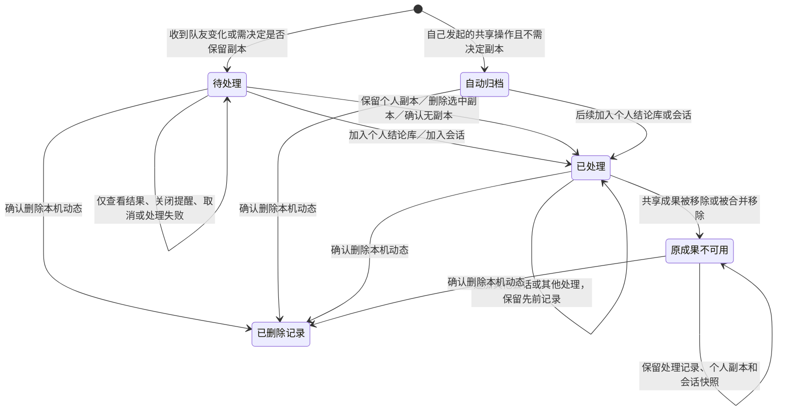

- “待处理”只显示未处理动态；“历史动态”只显示已处理或自动归档动态；“全部动态”显示两者。
- 每次成功处理记录时间、操作、目标个人结论或会话的当时名称，以及实际采用的共享成果版本。失败和取消不生成成功记录；同一目标、同一版本的重复操作去重。
- “加入会话”表示参考快照已加入该会话，不表示 AI 已接收，也不表示任务已完成。AI 接收状态在会话中单独展示。
- 从个人结论库再加入会话，也会回写该结论远端来源对应的动态。使用旧快照不会把较新的动态或删除动态标成已处理。
- 共享成果更新会产生新动态。移除后，已处理历史保留并显示“原成果已从共享区移除”；尚未处理的旧成果通知让位于新的删除通知。共享移除不会自动删除个人结论。
- 自己的操作自动归档时显示原因。旧版本只保存 `readAt` 而没有处理记录的动态，显示“旧记录未保存具体处理方式”，不推测曾经做过什么。
- 动态可以批量删除；删除只清除本机通知和随附处理记录，不删除结论、会话或共享成果。同一远端修订不会再次提醒，后续新修订仍会通知。

## 2. 个人结论

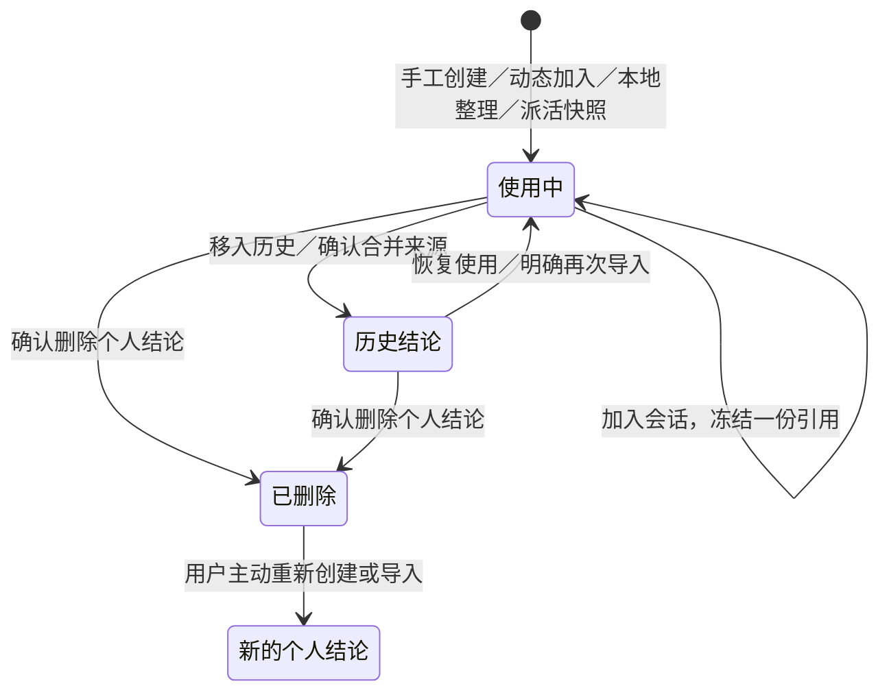

- 展示易读名称或别名、原名、正文、版本、来源、更新时间和使用中/历史状态。
- 正文、标题与别名可编辑；别名不改变内容版本。正文变化不会改写旧会话快照。历史结论须先恢复才能加入新会话。
- “移入历史”可恢复；“删除结论”会从使用中和历史列表移除，不提供恢复按钮。二者都不会删除共享内容或已有会话引用。
- 多来源归并仍显示各来源；远端移除只发出选择提示。个人手工修改的结论不会因自动同步被覆盖。
- 删除留下内部标记以防重启时由旧整理任务复活；这些标记不作为可用结论展示或推荐。

## 3. 会话引用与 AI 接收状态

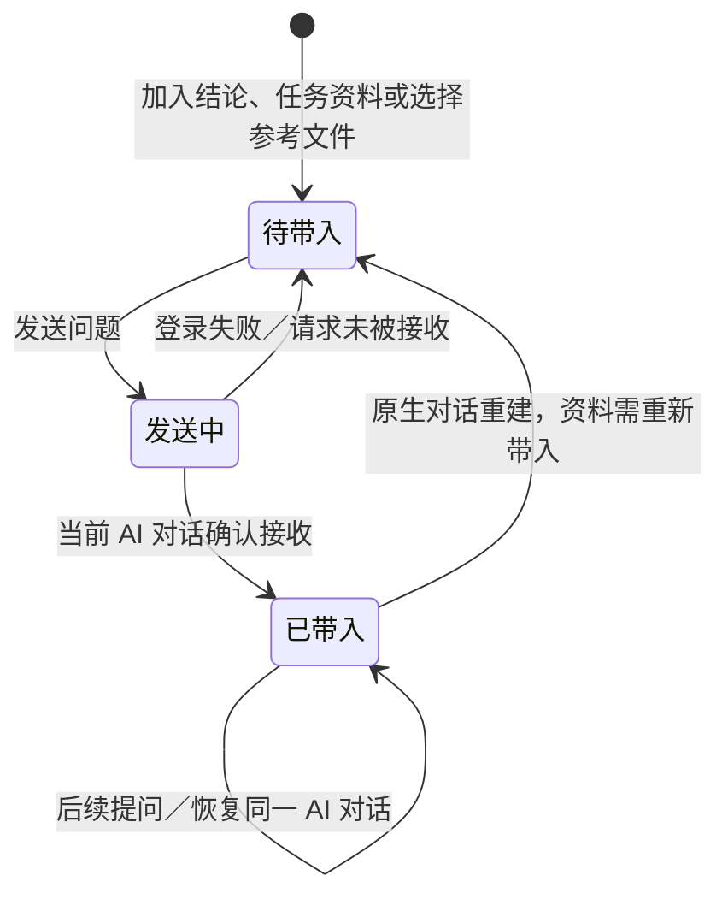

- 未接收的资料在输入框上方显示；已接收的资料只收进顶部“AI 参考内容”，标为“已带入”，不重复占据输入框。
- 普通参考文件在发送前可勾选或取消勾选。项目说明、任务资料和已明确加入的结论自动引用，不提供会话内取消入口。
- 已带入内容不能通过取消勾选从模型上下文中撤回，也不能就地改写冻结快照。个人结论编辑后，新会话可使用新版，旧会话继续使用原快照。
- 接收判断绑定实际 AI 对话和文件哈希；失败、重启与更换原生上下文不会被误算成已经接收。AI 接收后执行失败时，资料仍属于已带入。
- 会话可重命名、关闭、重新打开；关闭时保留消息、资料和输入草稿。已关闭会话不能新增引用；运行中的会话新增资料只影响下一次提问。
- 相同共享成果版本重复加入同一会话复用已有快照；不同版本保留各自快照。正文对话只显示用户原话，内部引用路径和哈希不混入用户气泡。旧会话中来源路径和哈希完全相同的重复引用只显示和发送一份；任一副本已被接收后，其他副本也显示已带入。原消息和快照不改写，不同来源或不同内容仍各自保留。顶部“AI 参考内容”显示已带入数量。

### 个人结论按要求处理

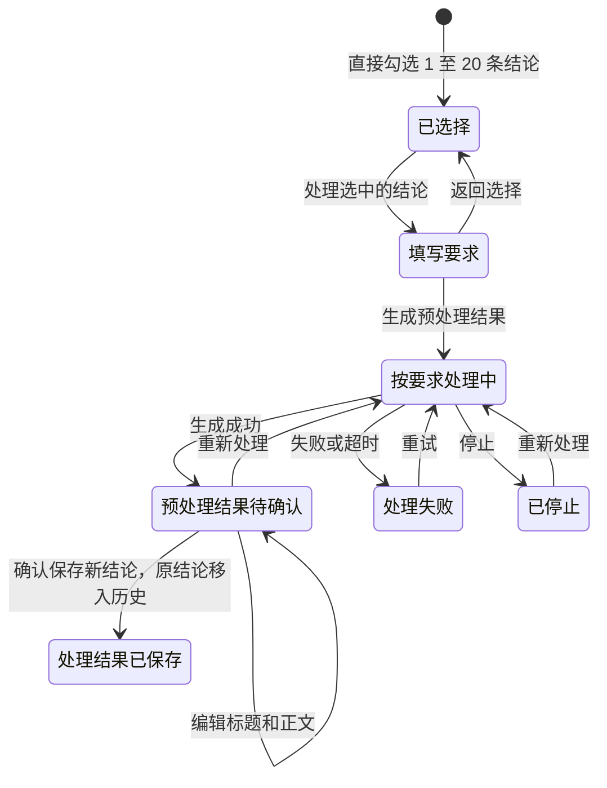

未选中时不显示处理按钮；切换历史范围或进入批量删除时清空处理选择。方向可以是提炼、对比、改写、行动建议或合并，单条结论也可处理。模型实际指令遵循用户要求；生成阶段不变更原结论。保存时再次校验来源版本，避免覆盖期间发生的编辑；共享区不受影响。

## 4. 整理与上传

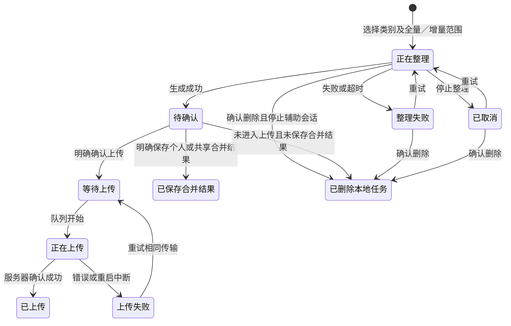

- 列表及详情展示整理范围、来源会话、创建/完成时间、结果数、当前状态和错误；多项上传有单项状态。
- 上传前可改结果名称、补充说明和选择项；合并草稿可审阅编辑后再保存。再次整理新建任务，不覆盖原结果。
- 进入上传流程或已保存合并结果后保留记录，不允许删除整理任务；列表显示“已保留，不可删除”。上传失败应重试既有传输，不通过删除任务掩盖结果不确定性。
- 已上传内容的本地名称可调整为别名；修改共享正文要走共享成果的权限与版本校验。传输页显示进度、成功/错误、目标位置及重试入口；可清理上传缓存，保留传输记录。

## 5. 派活任务

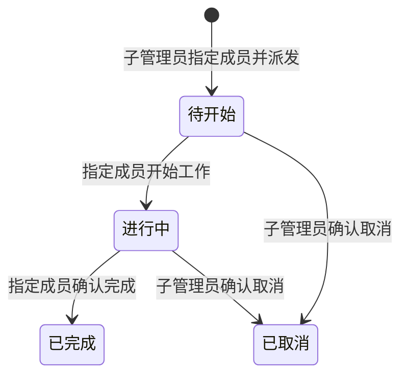

- 状态、负责人、派发人、任务要求和关联结论版本在任务页可见；结束后的任务在“全部任务”查看。
- 开始工作准备会话和输入草稿，不自动发送给模型；继续工作复用已有会话。
- 发布后的任务要求和引用固定。更正要求需取消并重新派发；终态不能恢复或直接删除，保留交接依据。取消、完成不删除成员已有会话。

## 6. 信息与操作检查表（内容协作）

| 信息 | 用户应能看见 | 可编辑 | 可删除/取消 | 本轮检查 |
| --- | --- | --- | --- | --- |
| 团队动态 | 事件、项目、作者、时间、处理方式、目标名称、采用版本 | 事件事实与处理记录不可手改；成果可设本地别名 | 单独/批量删除本机记录 | 补齐处理记录、历史范围、源移除后的历史保留 |
| 个人结论 | 名称/别名、正文、来源、版本、使用状态 | 标题、正文、个人别名 | 移入历史、恢复、单独/批量删除 | 明确个人本机归属；与共享内容分开 |
| 会话引用 | 待带入或已带入、资料名称和版本 | 冻结快照不可改；普通文件发送前可取消选择 | 已加入结论不可撤回；关闭会话保留 | 补齐接收状态展示、重复加入去重、关闭状态校验 |
| 整理任务 | 状态、来源、范围、结果、错误、时间 | 待提交名称/补充、待保存合并正文；提交后本地别名 | 未提交且未保存合并结果时可删除 | 补齐已保存合并任务的不可删除标记 |
| 传输记录 | 类型、目标、进度、错误、重试 | 不可改传输事实 | 允许清理缓存，记录保留 | 本地记录保存失败也进入可恢复状态；重试复用目标 |
| 派活任务 | 状态、负责人、派发人、要求、验收及引用 | 发布前编辑；发布后取消并重派 | 子管理员可取消，终态保留 | 本地准备成功后再开始，准备期间重新核对取消和修订 |

结论：已处理、已加入会话、AI 已接收、整理完成和上传完成是不同事实，各在相应页面展示，不互相代替。操作失败不显示成功状态；删除个人记录不连带删除共享内容或历史会话快照。

验证命令及实际结果见 [VERIFICATION.md](../VERIFICATION.md)。

## 7. 工作会话：启动、执行、停止与重启

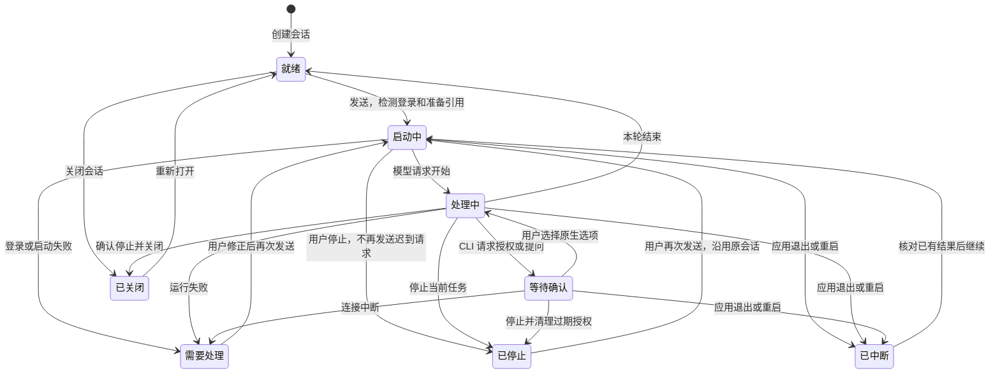

- 顶部展示启动、处理、等待确认、已停止或需要处理；中断原因显示在错误区。就绪表示当前没有运行任务，不等于派活任务或项目已完成。
- 停止覆盖登录检测、启动、能力解析和正在执行阶段；停止后保留原生会话、已有消息、输入草稿和引用。启动阶段尚未被发送的文字不会变成已发送消息。
- 授权只能回答仍存在的请求和 CLI 实际提供的选项；停止/关闭后清除授权，不把旧授权应用到下一轮。
- 重启不再把运行、等待授权或既有错误统一变为就绪。未完成任务显示中断，已有失败保留原因；不自动续跑。
- 关闭期间不允许发送、切换模型/权限或新增参考资料；项目说明在远端读取期间如果会话开始运行或关闭，也拒绝更新。会话标题、消息与快照保留。

## 8. 团队连接、账号登录和执行配置

### 团队连接

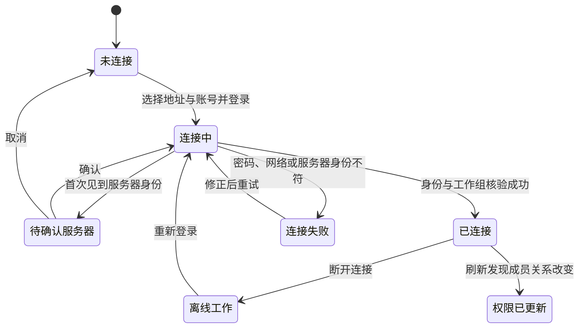

连接状态条、登录窗口和项目列表展示状态。离线只能使用最近一次明确授权且绑定相同账号、服务器和项目的本地工作区；共享操作仍需连接。新账号没有项目组时显示待分配，不假造空项目。身份变化须重新确认；撤权后远端操作受服务端实时检查，本地历史不删除。

### CLI 登录、模型和权限

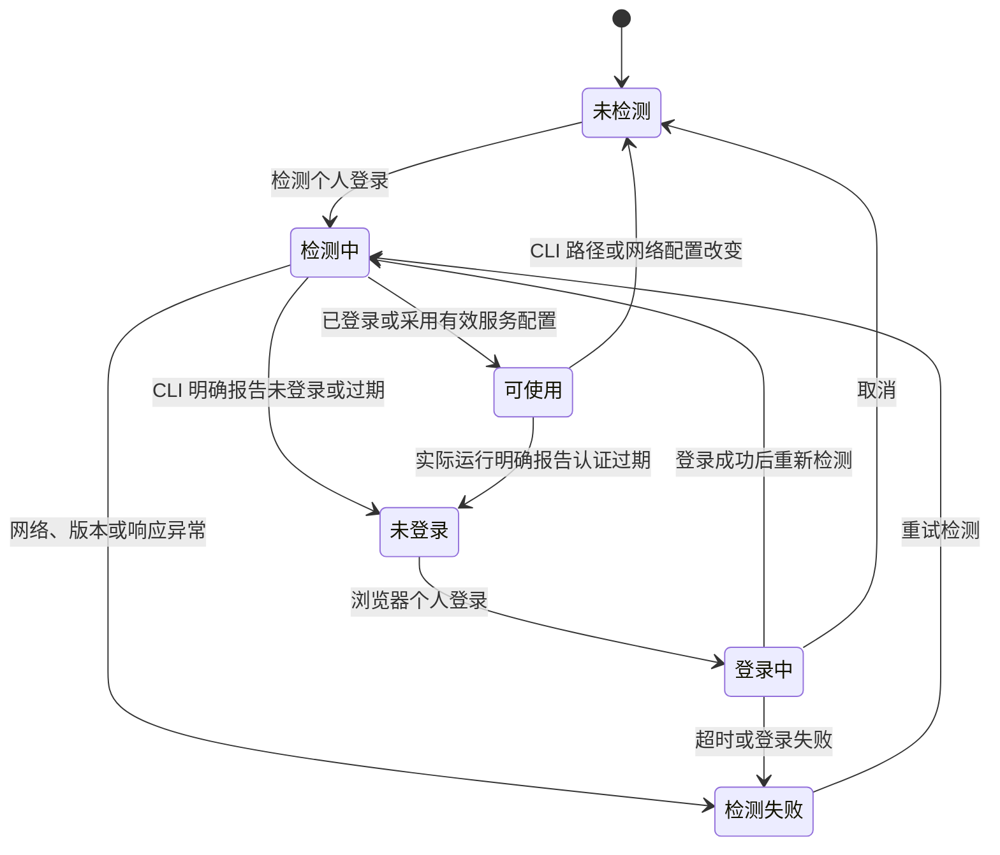

- 网络错误不等于未登录；取消登录不注销其他会话。并发工作/整理会话的检测不互相取消，迟到结果不覆盖新配置。
- 模型/额度为“读取中→已读取/读取失败→刷新”；切换账号或模型服务后清除旧列表、旧额度及旧错误，不把读取失败显示成额度为零。
- 模型和权限在空闲状态可切换；运行时要求明确停止，启动期间拒绝切换。权限由 CLI 实际反馈，界面显示有效配置与限制，不把请求的权限当成已生效。
- Skill/插件候选有读取中、可用、不可用和读取失败。选择只作用于下一条消息，发送时重新校验；不可用选择不会被静默忽略。已发送消息保留实际选择记录。

## 9. 传输、保存与恢复

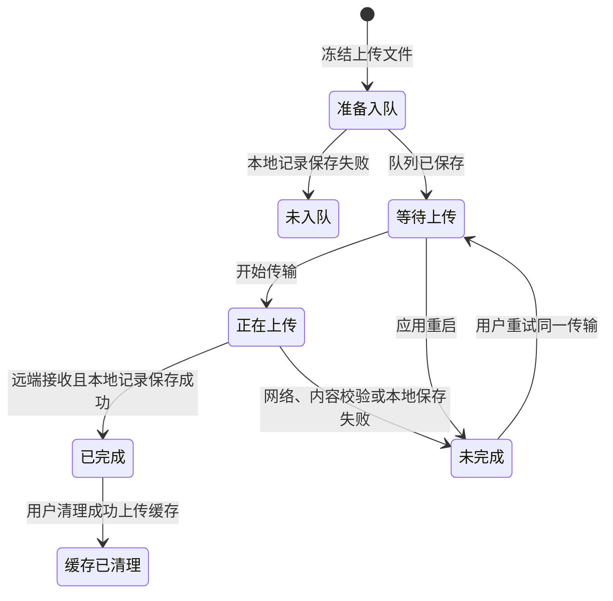

- 本地记录未保存成功前不开始上传；失败不会让队列停留在无法操作的运行状态。重试清零本次进度，并复用原目标、校验哈希和绑定账号；重复重试与重试成功记录被拒绝。
- 远端已经接收但本地保存失败时，显示未完成及错误，需要核对/重试；重试仍使用同一远端目标，不另建重复成果。
- 清理缓存只清理成功传输的包和上传副本，保留传输事实、原文件、会话和远端内容。活动中的上传没有删除记录入口。
- 自动保存为“已保存→保存中→已保存/保存失败”；失败文本留在编辑缓存，提供重试，页面切换不丢失输入。确认上传/保存先等待编辑落盘；提交期间正文冻结。
- 整理任务删除期间拒绝重试、重复删除和提交；停止辅助会话后清理该任务历次辅助尝试。已保存合并结果即使是旧数据、缺少上传标记，也不能再删除或重新生成。

## 10. 网络出口

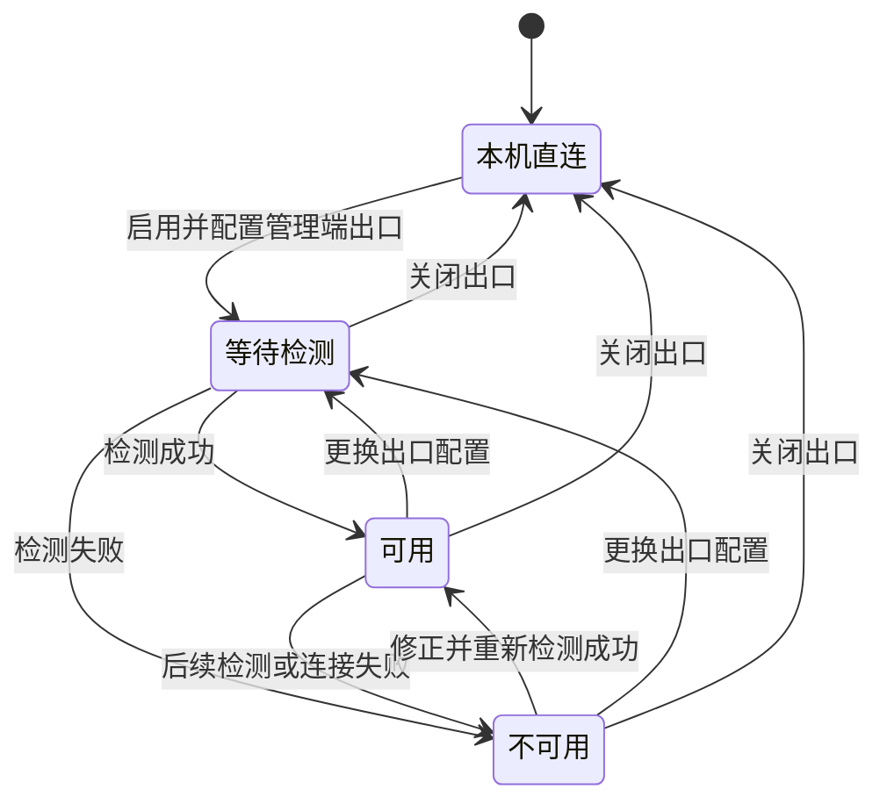

用户端同时区分是否启用、本机代理是否启动、远端是否通过检测。失败会清除先前的可用状态；旧检测在关闭、更换配置或新检测后返回，不得恢复旧状态。运行中的工作需要先结束或停止才能切换网络配置。管理端显示出口运行状态、活动连接和连接结果；停止时关闭隧道及未完成握手，接入码更新后旧码失效。

## 11. 文件预览、空间统计和读取结果

| 流程 | 状态和可见信息 | 允许的操作与防护 |
| --- | --- | --- |
| 会话文件 | 列表读取中、文件预览中、已展示、文件不存在/读取失败 | 刷新、选择文件、复制路径、定位目录、打开支持的文档；切换目标时清除旧预览和旧打开按钮，迟到结果不覆盖新文件 |
| 空间统计 | 正在统计、统计结果和采集时间、失败、已取消 | 可取消、重新统计、展开目录；切换服务器/成员清单后清空旧统计，旧成功/错误均不能覆盖当前统计 |
| 项目说明 | 未设置、已保存修订、正在保存、版本冲突、会话可采用新版 | 保存须核对远端修订；会话引用更新是独立明确操作，既有对话快照不会自动变更 |
| 共享成果 | 原作者提交、原作者更新、管理员维护、合并/移除、内容不可用 | 角色、作者和版本共同决定编辑权；合并确认前保留来源，版本冲突先刷新，不擅自覆盖 |

“没有内容”和“读取失败”不同。失败时展示错误及重试入口；已有结果如继续保留，必须保留采集时间或来源标识。网络请求的返回顺序不代表用户最终选择顺序。

## 12. 管理端环境与成员操作

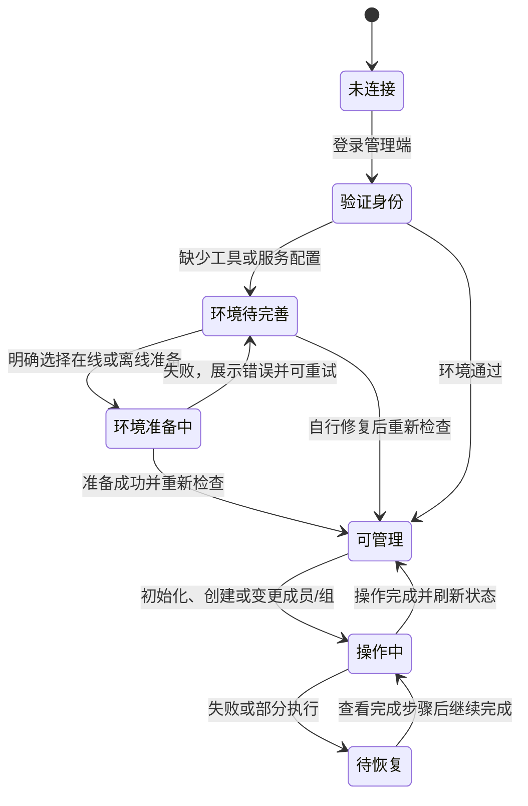

- 总管理员、项目子管理员和普通成员的可操作范围由真实身份决定。初始化、环境准备及成员变更运行时有忙碌状态；取消准备对话框不会执行安装，执行中不允许切换服务器。
- 账号创建未完成、未启用、缺少成员登录配置、未分配项目组等原因分别显示，不把“存在账号”视为“已能开始工作”。启用/停用、增减组和角色变更保留其他组的关系。
- 删除或降级最后一名子管理员需指定接任人或明确保留空缺；失败操作展示已完成步骤并可恢复，不通过重做创建覆盖半成品。
- 管理命令失败后尝试重新读取实际环境和成员状态；读取也失败时清空不可信状态，不继续显示旧成功结果。服务器软件准备与服务更新仍需用户明确执行，不随客户端启动自动运行。

## 13. 全流程核对与回归索引

| 范围 | 本轮核对结论 | 主要回归 |
| --- | --- | --- |
| 团队动态、个人结论与引用 | 延续前轮处理记录和旧引用去重规则，未发现需新增的转换 | `collaboration-lifecycle`、`conclusions`、`session-context` |
| 会话启动/停止、关闭/恢复、重启 | 修复登录检测阶段停止无效；新增已停止和中断可见状态；关闭后禁改权限和项目引用 | `workflow-states`、`session-experience`、`session-settings` |
| 授权、模型与 Skill | 保留原生授权边界；清除账号切换的旧读取状态 | `permissions`、`provider-auth`、`provider-capabilities`、组件界面回归 |
| 整理、取消、重试与删除 | 删除期间加互斥保护，清理历次辅助会话；旧已保存结果也按终态保护 | `workflow-states`、`preparation`、会话界面回归 |
| 上传、缓存和编辑保存 | 修复传输记录保存失败时的队列状态；进度重置、相同目标重试；关闭因保存失败被阻止后恢复保存能力 | `workflow-states`、`usability`、`core`、`local-preservation` |
| 派活 | 本地会话和引用准备好后再标进行中；准备期间被取消时停止交付会话 | `assignments` |
| 连接与离线授权 | 核对重连、账号/组变化、身份确认、离线工作边界 | `workspace`、`workgroups`、`local-space`、`server-identities` |
| 网络出口 | 修复失败后仍可用及旧检测回写 | `egress`、`egress-lifecycle` |
| 文件和空间统计 | 增加切换目标后的迟到结果保护；文件丢失时无旧文件操作按钮 | `session-files`、`storage-usage`、组件界面回归 |
| 管理员环境、初始化、成员与恢复 | 核对前置环境、忙碌、失败刷新、恢复和角色延续 | `admin`、`collaboration-lifecycle`、服务器 Python 回归 |

覆盖的是当前实现中的状态及明确操作边界。模型服务、SSH 和系统权限通过本地协议替身、隔离共享区及服务端测试验证，未在真实团队服务器上执行破坏性状态切换。

表中测试名对应 `tests/<名称>.test.ts`。组件界面回归使用 `npm run test:workflow-ui`，会话界面回归使用 `npm run test:session-ui`，管理端空间统计使用 `npm run test:storage-ui`。
