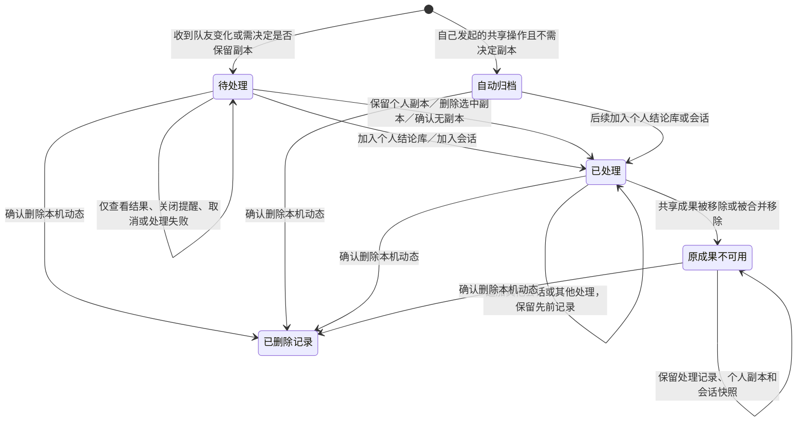
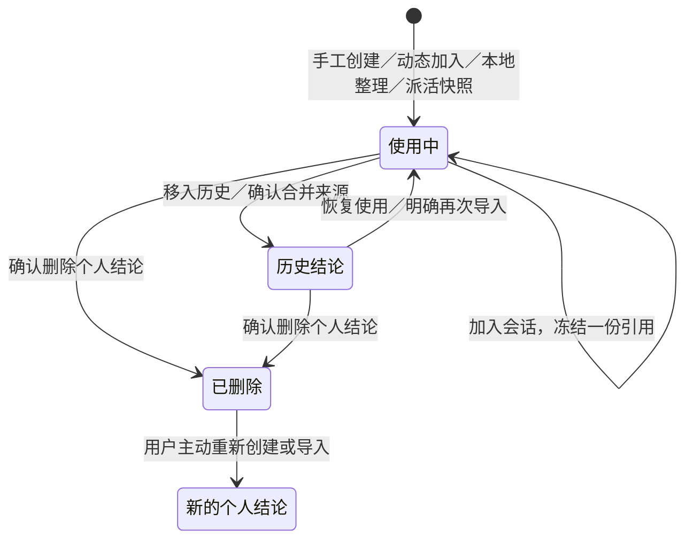
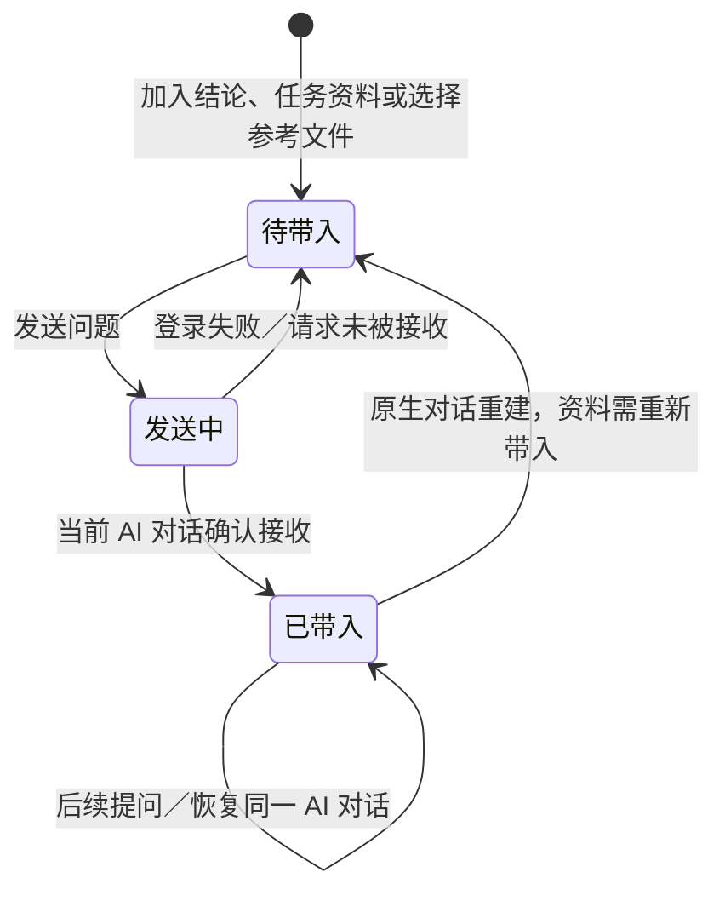
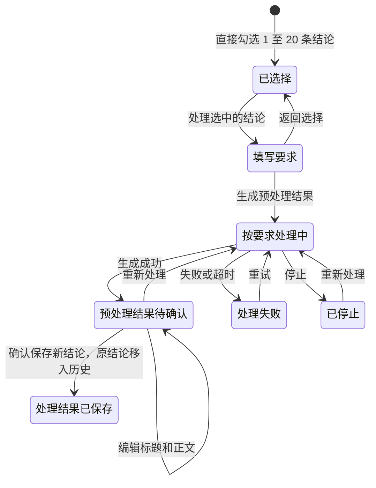
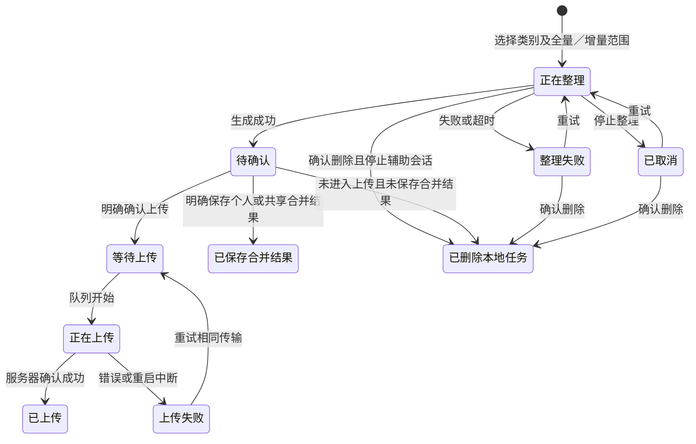
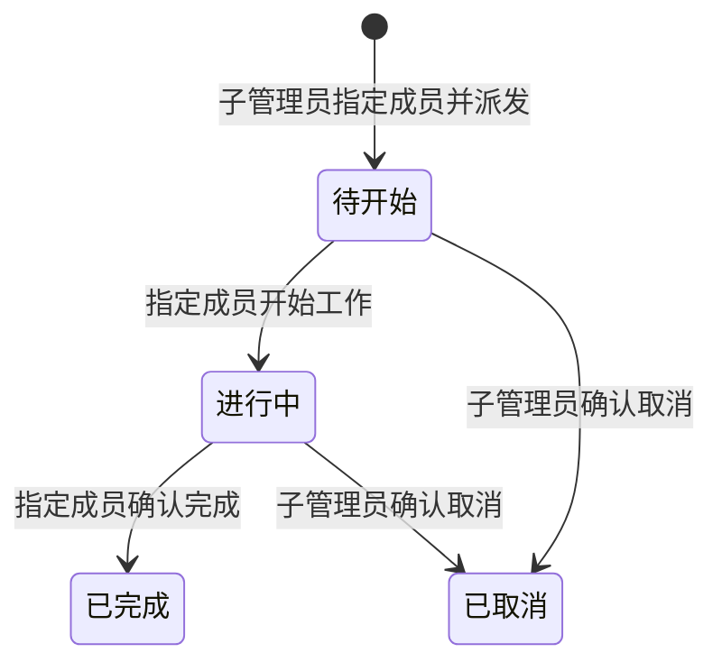

# 用户工作流状态与操作边界

检查日期：2026-09-21。范围：团队动态、个人结论、会话引用、成果整理、上传、派活任务。

这里的“个人结论库”保存在当前用户端的本机数据目录，按项目组织；它不是团队共享库，也不是跨电脑同步的云端个人库。不同账号应使用独立账号窗口。共享成果只有通过明确上传或管理员保存操作才会改变。

## 1. 团队动态与个人处理记录

- “待处理”只显示未处理动态；“历史动态”只显示已处理或自动归档动态；“全部动态”显示两者。
- 每次成功处理记录时间、操作、目标个人结论或会话的当时名称，以及实际采用的共享成果版本。失败和取消不生成成功记录；同一目标、同一版本的重复操作去重。
- “加入会话”表示参考快照已加入该会话，不表示 AI 已接收，也不表示任务已完成。AI 接收状态在会话中单独展示。
- 从个人结论库再加入会话，也会回写该结论远端来源对应的动态。使用旧快照不会把较新的动态或删除动态标成已处理。
- 共享成果更新会产生新动态。移除后，已处理历史保留并显示“原成果已从共享区移除”；尚未处理的旧成果通知让位于新的删除通知。共享移除不会自动删除个人结论。
- 自己的操作自动归档时显示原因。旧版本只保存 `readAt` 而没有处理记录的动态，显示“旧记录未保存具体处理方式”，不推测曾经做过什么。
- 动态可以批量删除；删除只清除本机通知和随附处理记录，不删除结论、会话或共享成果。同一远端修订不会再次提醒，后续新修订仍会通知。

## 2. 个人结论

- 展示易读名称或别名、原名、正文、版本、来源、更新时间和使用中/历史状态。
- 正文、标题与别名可编辑；别名不改变内容版本。正文变化不会改写旧会话快照。历史结论须先恢复才能加入新会话。
- “移入历史”可恢复；“删除结论”会从使用中和历史列表移除，不提供恢复按钮。二者都不会删除共享内容或已有会话引用。
- 多来源归并仍显示各来源；远端移除只发出选择提示。个人手工修改的结论不会因自动同步被覆盖。
- 删除留下内部标记以防重启时由旧整理任务复活；这些标记不作为可用结论展示或推荐。

## 3. 会话引用与 AI 接收状态

- 未接收的资料在输入框上方显示；已接收的资料只收进顶部“AI 参考内容”，标为“已带入”，不重复占据输入框。
- 普通参考文件在发送前可勾选或取消勾选。项目说明、任务资料和已明确加入的结论自动引用，不提供会话内取消入口。
- 已带入内容不能通过取消勾选从模型上下文中撤回，也不能就地改写冻结快照。个人结论编辑后，新会话可使用新版，旧会话继续使用原快照。
- 接收判断绑定实际 AI 对话和文件哈希；失败、重启与更换原生上下文不会被误算成已经接收。AI 接收后执行失败时，资料仍属于已带入。
- 会话可重命名、关闭、重新打开；关闭时保留消息、资料和输入草稿。已关闭会话不能新增引用；运行中的会话新增资料只影响下一次提问。
- 相同共享成果版本重复加入同一会话复用已有快照；不同版本保留各自快照。正文对话只显示用户原话，内部引用路径和哈希不混入用户气泡。旧会话中来源路径和哈希完全相同的重复引用只显示和发送一份；任一副本已被接收后，其他副本也显示已带入。原消息和快照不改写，不同来源或不同内容仍各自保留。顶部“AI 参考内容”显示已带入数量。

### 个人结论按要求处理

未选中时不显示处理按钮；切换历史范围或进入批量删除时清空处理选择。方向可以是提炼、对比、改写、行动建议或合并，单条结论也可处理。模型实际指令遵循用户要求；生成阶段不变更原结论。保存时再次校验来源版本，避免覆盖期间发生的编辑；共享区不受影响。

## 4. 整理与上传

- 列表及详情展示整理范围、来源会话、创建/完成时间、结果数、当前状态和错误；多项上传有单项状态。
- 上传前可改结果名称、补充说明和选择项；合并草稿可审阅编辑后再保存。再次整理新建任务，不覆盖原结果。
- 进入上传流程或已保存合并结果后保留记录，不允许删除整理任务；列表显示“已保留，不可删除”。上传失败应重试既有传输，不通过删除任务掩盖结果不确定性。
- 已上传内容的本地名称可调整为别名；修改共享正文要走共享成果的权限与版本校验。传输页显示进度、成功/错误、目标位置及重试入口；可清理上传缓存，保留传输记录。

## 5. 派活任务

- 状态、负责人、派发人、任务要求和关联结论版本在任务页可见；结束后的任务在“全部任务”查看。
- 开始工作准备会话和输入草稿，不自动发送给模型；继续工作复用已有会话。
- 发布后的任务要求和引用固定。更正要求需取消并重新派发；终态不能恢复或直接删除，保留交接依据。取消、完成不删除成员已有会话。

## 6. 信息与操作检查表

| 信息 | 用户应能看见 | 可编辑 | 可删除/取消 | 本轮检查 |
| --- | --- | --- | --- | --- |
| 团队动态 | 事件、项目、作者、时间、处理方式、目标名称、采用版本 | 事件事实与处理记录不可手改；成果可设本地别名 | 单独/批量删除本机记录 | 补齐处理记录、历史范围、源移除后的历史保留 |
| 个人结论 | 名称/别名、正文、来源、版本、使用状态 | 标题、正文、个人别名 | 移入历史、恢复、单独/批量删除 | 明确个人本机归属；与共享内容分开 |
| 会话引用 | 待带入或已带入、资料名称和版本 | 冻结快照不可改；普通文件发送前可取消选择 | 已加入结论不可撤回；关闭会话保留 | 补齐接收状态展示、重复加入去重、关闭状态校验 |
| 整理任务 | 状态、来源、范围、结果、错误、时间 | 待提交名称/补充、待保存合并正文；提交后本地别名 | 未提交且未保存合并结果时可删除 | 补齐已保存合并任务的不可删除标记 |
| 传输记录 | 类型、目标、进度、错误、重试 | 不可改传输事实 | 允许清理缓存，记录保留 | 已有可见状态与重试；保持现有边界 |
| 派活任务 | 状态、负责人、派发人、要求、验收及引用 | 发布前编辑；发布后取消并重派 | 子管理员可取消，终态保留 | 已有状态与角色校验；保持现有边界 |

结论：已处理、已加入会话、AI 已接收、整理完成和上传完成是不同事实，各在相应页面展示，不互相代替。操作失败不显示成功状态；删除个人记录不连带删除共享内容或历史会话快照。

验证命令及实际结果见 [VERIFICATION.md](../VERIFICATION.md)。
